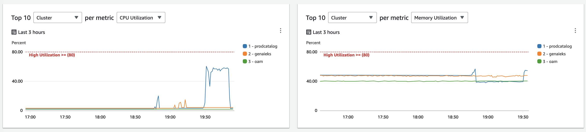
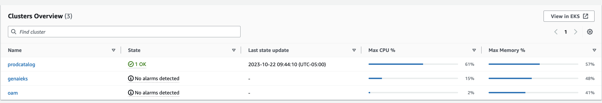
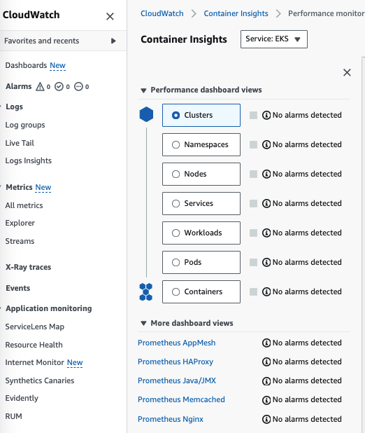
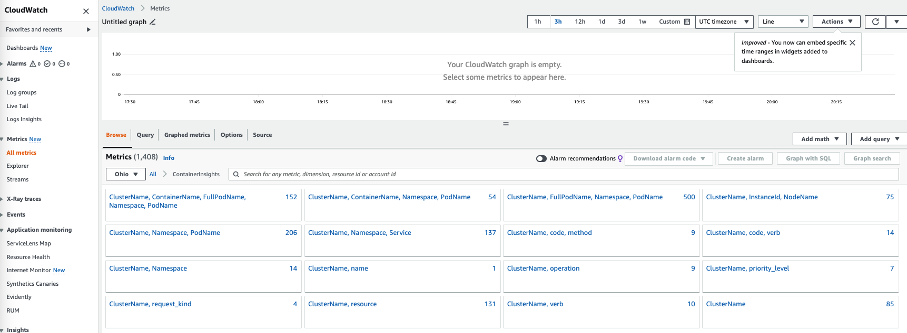

# CloudWatch Insights Add-on

The Cloudwatch Insights add-on adds support for [CloudWatch Insights](https://docs.aws.amazon.com/AmazonCloudWatch/latest/monitoring/deploy-container-insights-EKS.html) to an EKS cluster.
This replaces the current [Container Insights](./container-insights.md) add-on and all customers on it, should migrate to
CloudWatch Insights.

Customers can use CloudWatch Insights to collect, aggregate, and summarize metrics and logs from your containerized 
applications and microservices. Container Insights collects data as performance log events using an embedded metric
format. These performance log events are entries that use a structured JSON schema that enables high-cardinality data
to be ingested and stored at scale. From this data, CloudWatch creates aggregated metrics at the cluster, node, pod,
task, and service level as CloudWatch metrics. The metrics that Container Insights collects are available in
CloudWatch automatic dashboards, and also viewable in the Metrics section of the CloudWatch console.

**IMPORTANT**

CloudWatch does not automatically create all possible metrics from the log data, to help you manage your Container
Insights costs. However, you can view additional metrics and additional levels of granularity by using CloudWatch Logs
Insights to analyze the raw performance log events.

Metrics collected by Container Insights are charged as custom metrics. For more information about
[CloudWatch pricing](https://aws.amazon.com/cloudwatch/pricing/), see Amazon CloudWatch Pricing.

Note: that this add-on cannot co-exist with `adot-addon`, `cloudwatch-adot-addons` or `cloudwatch-logs` on same EKS
cluster as they have conflicting and redundant interactions.

## Usage

Add the following as an add-on to your main.ts file to add CloudWatch Insights to your cluster

```typescript
import 'source-map-support/register';
import * as cdk from 'aws-cdk-lib';
import * as blueprints from '@aws-quickstart/eks-blueprints';

const app = new cdk.App();

const addOn = new blueprints.addons.CloudWatchInsights();

const blueprint = blueprints.EksBlueprint.builder()
  .version("auto")
  .addOns(addOn)
  .build(app, 'my-stack-name');
```

## Prerequisites

Once the CloudWatch Insights add-on has been installed in your cluster, validate that the
`AWS Cloudwatch Observability Controller` is installed and FluentBit is installed: 

```bash
kubectl get pods -n amazon-cloudwatch
```

You should see output similar to the following respectively:

```
NAMESPACE           NAME                                                 READY   STATUS    RESTARTS        AGE
amazon-cloudwatch   amazon-cloudwatch-observability-controller-manager   1/1     Running   1 (4d22h ago)   5d
amazon-cloudwatch   cloudwatch-agent                                     1/1     Running   1 (4d22h ago)   5d
amazon-cloudwatch   fluent-bit                                           1/1     Running   1 (4d22h ago)   5d
```

## CloudWatch Dashboard

Once enabled, enhanced container insights page looks like below from AWS console, with the high level summary of your
clusters, kube-state and control-plane metrics. The Container Insights dashboard shows cluster status and alarms.
It uses predefined thresholds for CPU and memory to quickly identify which resources are having higher consumption,
and enabling proactive actions to avoid performance impact.


Additional functionality of the addon is listed in this blog [Introducing CloudWatch Insights with Enhanced Monitoring](https://aws.amazon.com/blogs/mt/new-container-insights-with-enhanced-observability-for-amazon-eks/).

### View Top 10 Lists

The CloudWatch Insights Dashboard can also let you quickly view the Top 10 lists of Cluster, Nodes, Pods, Workloads, and
Containers as shown below. Based on their consumption, you can set up critical charts that let you identify risky components
without using alarms and before you are resource constrained.



### Cluster Overview

The dashboard also lets you quickly view the consumption of your cluster, with the clusters ranked on their "criticality"
where they're top ranking if they're in alarm, and then all the others are ranked based on resource consumption.
They're visible in a list view as shown below.



### Popular Workloads

CloudWatch insights has pre-built automatic dashboards and alarms for popular workloads, and it allows you to drill into
logs generated by those workloads as well.




### Metrics namespaces

CloudWatch insights also exposes the new "ContainersInsights" metrics namespace, it contains all the various dimensions 
of EKS clusters and the data that's exported from the CloudWatch agents.

