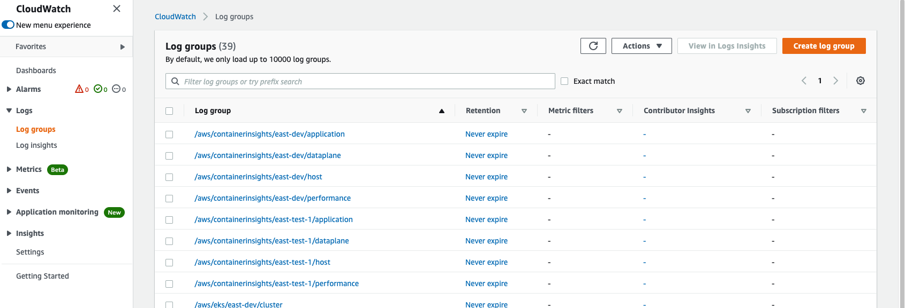

# Container Insights add-on

The Container Insights add-on provides collects, aggregates, and summarizes metrics and logs from your containerized applications and microservices. It uses an embedded metric format to collect data as performance-log events. These events are entries that use a structured JSON schema that enables high-cardinality data to be ingested and stored at scale.

[Amazon CloudWatch Logs Insights](https://docs.aws.amazon.com/AmazonCloudWatch/latest/logs/AnalyzingLogData.html) creates aggregated reports from the data as metrics at the cluster, node, pod, task, and service levels. The metrics are available in CloudWatch dashboards and viewable in the **Metrics** section of the CloudWatch console.

>**Important**: Metrics that are collected by Container Insights are charged as custom metrics. Amazon CloudWatch does not automatically create all possible metrics from log data. To help you manage the cost of Container Insights, review additional metrics and levels of granularity by using Amazon CloudWatch Logs. For more information, see [Amazon CloudWatch pricing](https://aws.amazon.com/cloudwatch/pricing/).

## Usage

Use `main.ts` to add Container Insights to your cluster: 

```typescript
import { AddOns }  from '@aws-quickstart/ssp-amazon-eks';

const myClusterAutoscaler = new AddOns.ContainerInsightsAddOn();
const addOns: Array<ClusterAddOn> = [ myClusterAutoscaler ];

const app = new cdk.App();
new EksBlueprint(app, 'my-stack-name', addOns, [], {
  env: {
      account: <AWS_ACCOUNT_ID>,
      region: <AWS_REGION>,
  },
});
```

To update your CDK stack, run `cdk deploy`. 

## Prerequisites

With Container Insights installed, use `kubectl get all -n amazon-cloudwatch` to verify that the CloudWatch agent and FluentD daemons are running:
```
NAME                           READY   STATUS    RESTARTS   AGE
pod/cloudwatch-agent-k8wxl     1/1     Running   0          105s
pod/fluentd-cloudwatch-78zv4   1/1     Running   0          105s

NAME                                DESIRED   CURRENT   READY   UP-TO-DATE   AVAILABLE   NODE SELECTOR   AGE
daemonset.apps/cloudwatch-agent     1         1         1       1            1           <none>          107s
daemonset.apps/fluentd-cloudwatch   1         1         1       1            1           <none>          106s
```

To enable or disable control-plane logs, run the following command from your terminal - `aws eks update-cluster-config \
    --region us-east-2 \
    --name east-dev \
    --logging '{"clusterLogging":[{"types":["api","audit","authenticator","controllerManager","scheduler"],"enabled":true}]}'`

The following is an example output:
```json
{
    "update": {
        "id": "<883405c8-65c6-4758-8cee-2a7c1340a6d9>",
        "status": "InProgress",
        "type": "LoggingUpdate",
        "params": [
            {
                "type": "ClusterLogging",
                "value": "{\"clusterLogging\":[{\"types\":[\"api\",\"audit\",\"authenticator\",\"controllerManager\",\"scheduler\"],\"enabled\":true}]}"
            }
        ],
        "createdAt": 1553271814.684,
        "errors": []
    }
}
```

To monitor the status of your cluster's log-configuration update, run the following command: 
```
aws eks describe-update \ --region <region-code> \ --name <prod> \ --update-id <883405c8-65c6-4758-8cee-2a7c1340a6d9>
```

The following is an example of the output for when the update completes: 

```json
{
    "update": {
        "id": "<883405c8-65c6-4758-8cee-2a7c1340a6d9>",
        "status": "Successful",
        "type": "LoggingUpdate",
        "params": [
            {
                "type": "ClusterLogging",
                "value": "{\"clusterLogging\":[{\"types\":[\"api\",\"audit\",\"authenticator\",\"controllerManager\",\"scheduler\"],\"enabled\":true}]}"
            }
        ],
        "createdAt": 1553271814.684,
        "errors": []
    }
}
```

## View metrics for clusters and workloads
To view clusters and workload metrics, navigate to **Performance Monitoring**. To view CPU utilization and memory in addition to other important metrics, such as network performance, choose **EKS Pods and Clusters**.


## View cluster logs
After you enable any of the control-plane log types for your Amazon EKS cluster, view the logs on the Amazon CloudWatch console:

1. Navigate to the CloudWatch console, and choose the cluster that you want to view logs for. The format of the log-group name is `/aws/eks/<cluster-name>/cluster`.
2. Choose a log stream to view. The following list describes the format of the log-stream name for each log type:

    - Kubernetes API server component logs (api): `kube-apiserver-<nnn...>`
    - Audit (audit): `kube-apiserver-audit-<nnn...>`
    - Authenticator (authenticator): `authenticator-<nnn...>`
    - Controller manager (controllerManager): `kube-controller-manager-<nnn...>`
    - Scheduler (scheduler): `kube-scheduler-<nnn...>`

To view all of the log streams from your Amazon EKS control plane, under **Logs**, choose **Log groups**. 




## View workload logs

Navigate to the AWS CloudWatch Logs console, and then follow these steps: 

1. In the navigation pane, choose **Insights**.
2. Near the top of the screen is the query editor. When you first open Amazon CloudWatch Logs, this box contains a default query that returns the 20 most recent events.
3. In the box above the query editor, choose one of the Container Insights log groups to query. For the following example queries to work, the log-group name must end with `performance` (for example, `/aws/containerinsights/east-dev/performance`).
4. When you choose a log group, CloudWatch Logs detects fields in the data and displays them under **Discovered** in the right-hand pane. It also displays a bar graph of log events in the log group over time. The bar graph shows the distribution of events in the log group that matches your query and time range (not only the events displayed in the table).

In the query editor, replace the default query with the following, and choose **Run query**:

```
STATS avg(node_cpu_utilization) as avg_node_cpu_utilization by NodeName SORT avg_node_cpu_utilization DESC
```

This query provides a list of nodes, sorted by average CPU utilization. The following image is an example of what the visualization should look like:


To try another example, replace the previous query with the following, and choose **Run query**. More sample queries are listed later on this page.

```
STATS avg(number_of_container_restarts) as avg_number_of_container_restarts by PodName SORT avg_number_of_container_restarts DESC
```

This query provides a list of pods, sorted by the average number of container restarts:


To try another query, use the **Include** fields in the list at the right of the screen. For more information, see [CloudWatch Logs Insights query syntax](https://docs.aws.amazon.com/AmazonCloudWatch/latest/logs/CWL_QuerySyntax.html).

## View containers through the container map in Container Insights

From the **Container Insights** tab, choose **View your container map**, which provides a map of your namespaces and their associated pods and services.

