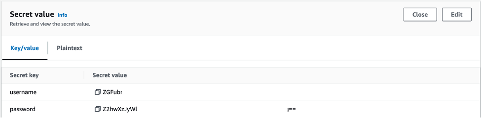

# Flux CD Add-on

[Flux CD](https://fluxcd.io/flux/) is a tool for keeping Kubernetes clusters in sync with sources of configuration (like Git repositories), and automating updates to configuration when there is new code to deploy. The Flux CD add-on provisions [Flux CD](https://github.com/fluxcd/flux2) into an EKS cluster, and bootstrap your workloads from public and private Git repositories. 

The Flux CD add-on allows platform administrators to combine cluster provisioning and workload bootstrapping in a single step and enables use cases such as replicating an existing running production cluster in a different region in a matter of minutes. This is important for business continuity and disaster recovery cases as well as for cross-regional availability and geographical expansion.

Please see the documentation below for details on automatic boostrapping with FluxCD add-on. If you prefer manual bootstrapping (once your cluster is deployed with this add-on included), you can find instructions on getting started with Argo CD in our [Getting Started](https://fluxcd.io/flux/get-started/) guide.

Full Argo CD project documentation [can be found here](https://fluxcd.io/flux/).

## Usage

### Without Bootstrapping Repos:

To provision and maintain FluxCD components without any bootstrapping, the add-on provides a no-argument constructor to get started. 

```typescript
new blueprints.addons.FluxCDAddOn({ 
                version: 'v0.38.1')}

```

The above will create an `flux-system` namespace and install all Flux CD components. Please take a look at  at bootstrap workloads and add repositories in the [Getting Started](https://fluxcd.io/flux/guides/) documentation.

### With Bootstrapping Repos:

To provision and maintain FluxCD component with bootstrapping repos, the add-on provides a constructor to get started.

```typescript

new blueprints.addons.FluxCDAddOn({ 
                version: 'v0.38.1',          
                bootstrapRepo: [
                    {
                        repoUrl: 'https://github.com/xxxxx/fluxcd2.git',
                        name: 'frontend-application',
                        credentialsSecretName: 'github-flux2', //secret manager
                        credentialsType: 'USERNAME',
                        targetRevision: 'main',
                        path: './microservice-1',
                        gitRepoSpecInterval: '2m0s',
                        kustomizationSpecInterval: '5m0s',
                        kustomizationTargetNamespace: 'frontend-application-ns'
                    }   
                ],
            }),

```


## Functionality

1. Creates the namespace `flux-system` by default.
2. Deploys the [flux-cd](https://fluxcd.io/flux/) via Kubernetes manifests into the cluster.
3. Allows to specify multiple `GitRepository` selecting the required authentication method as username/password or username/token (SSH currently not supported but can be added later).

## Pre-Requisites

FluxCD Add-On has the following two high level properties.
1. version (required): Flux cd version to install (of type string)
2. bootstrapRepo (optional): If provided, the addon will bootstrap the app or apps in the provided repository(ies). (of type list)
    

There are two ways that the fluxcd can be configured as described below:
### Without Bootstrapping Repos:

1. The only information that is needed for the FluxCD to get installed without Git Repositories configuartion is FluxCD version number.

### With Bootstrapping Repos:

    ```typescript
    bootstrapRepo: [
                    {
                        repoUrl: 'https://github.com/xxxxx/fluxcd2.git',
                        name: 'frontend-application',
                        credentialsSecretName: 'github-flux2', //secret manager
                        credentialsType: 'USERNAME',
                        targetRevision: 'main',
                        path: './microservice-1',
                        gitRepoSpecInterval: '2m0s',
                        kustomizationSpecInterval: '5m0s',
                        kustomizationTargetNamespace: 'frontend-application-ns'
                    }
                ]              
    ```

1)	The fluxcd require information about the github repo(s) that it needs to sync against in your EKS cluster. Please provide the github repo URL in repoUrl variable:

    repoUrl: 'https://github.com/xxxxx/fluxcd2.git',


2)	Please create the secret(s) in secret manager in the same region and supplied the name of your secret manager’s secret(s) in the credentialsSecretName variable

    The secret type should be “Other type of secret”

    The secret should have the following key value pairs:
    

    - Where username is your github username encoded base64
    - Where password is your github token encoded base64


## Bootstrapping 

The Blueprints framework provides an approach to bootstrap workloads and/or additional add-ons from a customer GitOps repository. In a general case, the bootstrap GitOps repository may contains an App of Apps that points to all workloads and add-ons.  

In order to enable bootstrapping, the add-on allows passing an `bootstrapRepo` optional variable at construction time. The following repository types are supported at present:

1. Public HTTP/HTTPS repositories (e.g., GitHub)
2. Private HTTPS accessible git repositories requiring username/password authentication.
3. Private HTTPS accessible GitHub repositories accessible with GitHub token. 

An example is provided below, along with an approach that could use a separate app of apps to bootstrap workloads in different stages, which is important for a software delivery platform as it allows segregating workloads specific to each stage of the SDLC and defines clear promotion processes through GitOps.

```typescript
new blueprints.addons.FluxCDAddOn({ 
                version: 'v0.38.1',          
                bootstrapRepo: [
                    {
                        repoUrl: 'https://github.com/xxxxx/fluxcd2.git',
                        name: 'frontend-application',
                        credentialsSecretName: 'github-flux2', //secret manager
                        credentialsType: 'USERNAME',
                        targetRevision: 'main',
                        path: './microservice-1',
                        gitRepoSpecInterval: '2m0s',
                        kustomizationSpecInterval: '5m0s',
                        kustomizationTargetNamespace: 'frontend-application-ns'
                    },
                    {
                        repoUrl: 'https://github.com/xxxx/fluxcd2.git',
                        name: 'backend-application',
                        credentialsSecretName: 'github-flux2', //secret manager
                        credentialsType: 'USERNAME',
                        targetRevision: 'main',
                        path: './microservice-2',
                        gitRepoSpecInterval: '2m0s',
                        kustomizationSpecInterval: '5m0s',
                        kustomizationTargetNamespace: 'backend-application-ns'
                    }
                ],
            }),
```

Flux is constructed with the GitOps Toolkit components. FluxCD toolkit provides provide multiple controllers which perform different functionalities. Among them two types of controllers which the FluxCD AddOn make use of are:

1. Source Controller:
    The main role of the source management component is to provide a common interface for artifacts acquisition. The source API defines a set of Kubernetes objects that cluster admins and various automated operators can interact with to offload the Git and Helm repositories operations to a dedicated controller. We have used the [GitRepository API](https://fluxcd.io/flux/components/source/gitrepositories/) which defines a Source to produce an Artifact for a Git repository revision. In our case, we have the following code which setup the git repository:

        ```typescript

            const gitRepoManifest = cluster.addManifest(`GitRepoSelf-${i}`, {
            apiVersion: 'source.toolkit.fluxcd.io/v1beta1',
            kind: 'GitRepository',
            metadata: {
                name: `${fluxRepo.name}-repository`,
                namespace: this.options.namespace
            },
            spec: {
                interval: fluxRepo?.gitRepoSpecInterval,  //user provided input via bootstrap configuration object
                ref: {
                    branch: fluxRepo?.targetRevision, //user provided input via bootstrap configuration object
                },
                secretRef: {
                    name: fluxRepo?.credentialsSecretName, //user provided input via bootstrap configuration object
                },
                url: fluxRepo?.repoUrl //user provided input via bootstrap configuration object
            }
        });

        ```

2. Kustomize Controller:
    The [kustomize-controller](https://fluxcd.io/flux/components/kustomize/kustomization/) is a Kubernetes operator, specialized in running continuous delivery pipelines for infrastructure and workloads defined with Kubernetes manifests and assembled with Kustomize. The following is an example of a Flux Kustomization that reconciles on the cluster the Kubernetes manifests stored in a Git repository.

        ```typescript

        let kustomization = cluster.addManifest(`kustomization-${i}`, {
            apiVersion: 'kustomize.toolkit.fluxcd.io/v1beta2',
            kind: 'Kustomization',
            metadata: {
                name: `${fluxRepo.kustomizationTargetNamespace}-kustomization`,
                namespace: this.options.namespace,
            },
            spec: {
                interval: fluxRepo?.kustomizationSpecInterval, //user provided input via bootstrap configuration object
                targetNamespace: fluxRepo?.kustomizationTargetNamespace, //user provided input via bootstrap configuration object
                sourceRef: {
                    kind: 'GitRepository',
                    name: `${fluxRepo.name}-repository`,
                },
                path: fluxRepo?.path, //user provided input via bootstrap configuration object
                prune: true
            }
        });

        ```


### Private Repositories

**Username Password and Token Authentication** 

1. Set `credentialsType` to `USERNAME` or `TOKEN` when defining `ApplicationRepository[]` in the FluxCD add-on configuration.
2. Define the secret in the AWS Secret Manager as "Key Value" and set fields `username` and `password` to the desired values (clear text). For `TOKEN` username could be set to any username and password field set to the GitHub token. Replicate to the desired regions.
3. The username and the password information should be base64 encoded.
4. Make sure that for this type of authentication your repository URL is set as `https`, e.g. https://github.com/aws-samples/eks-blueprints-workloads.git.

Example Structure for `USERNAME` and `TOKEN` authentication type:
```json
{
    "username": "YOUR_GIT_USERNAME", 
    "password": "YOUR PASSWORD OR TOKEN"
}
```

### Validate

Once the flux has been installed and to validate, use 
```
kubectl get all --namespace=flux-system

```
It will show all the different resource available in the flux-system namespace.

If you have used the constructor with bootstrap option, run the kubectl command to see if the resource for your application has been deployed in the namespace specified in boot bootstrapRepo.kustomizationTargetNamespace. so for example:

```
kubectl get pods -n backend-application-ns

```
Making a change to the pod manifest defination in the github repo, will result in fluxcd to deploy the changes in your kustomizationTargetNamespace.
