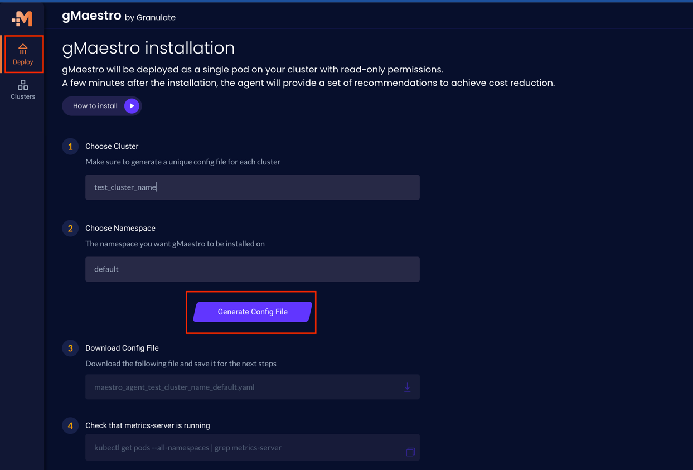
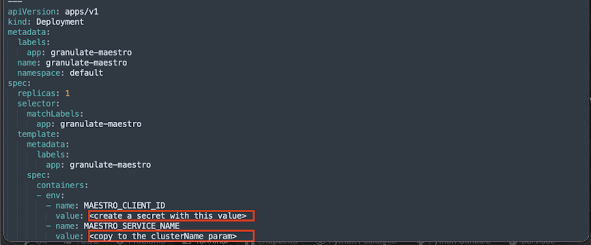

# gMaestro add-on for Amazon EKS Blueprints

This add-on deploys the [gMaestro Agent](https://app.granulate.io/) on Amazon EKS using the [eks-blueprints](https://github.com/aws-quickstart/cdk-eks-blueprints) [CDK](https://aws.amazon.com/cdk/) construct.

gMaestro is a Kubernetes cost optimization solution that helps companies reduce spending on un-utilized resources by up to 60%. With gMaestro, you gain full visibility into K8s clusters, seamlessly interact with HPA scaling policies, and achieve your cost-performance goals by applying custom rightsizing recommendations based on actual usage in production.

This add-on will deploy gMaestro agent on a namespace of your choice and create it if it doesn't exist.


## Prerequisites
Before using gMaestro, you need to:
1. [Sign up](https://app.granulate.io/gMaestroSignup) to the gMaestro platform
2. Download a config YAML file - After signing up to gMaestro, navigate to the [Deploy](https://app.granulate.io/) on the left-hand menu, fill in the required fields and click on "Generate Config File" as shown bellow:





3. Create a secret (as a plaintext, not key/value) in AWS Secrets Manager:

  ```bash
  export MAESTRO_CLIENT_ID="<MAESTRO_CLIENT_ID value from the deployment section in the downloaded config file>"
  export MAESTRO_SECRET_NAME="<MAESTRO_SECRET_NAME your preferred secret name>"
  aws secretsmanager create-secret --name <MAESTRO_SECRET_NAME> --region $AWS_REGION \
      --description "Encrypted client ID for Granulate gMaestro" \
      --secret-string "<MAESTRO_CLIENT_ID>"
  ```

## Installation

Using [npm](https://npmjs.org):

```bash
$ npm i @granulate/gmaestro-eks-blueprints-addon
```

## Usage

```typescript
import 'source-map-support/register';
import * as cdk from 'aws-cdk-lib';
import * as blueprints from '@aws-quickstart/eks-blueprints';
import {GmaestroAddOn} from '@granulate/gmaestro-eks-blueprints-addon';

const app = new cdk.App();

const addOn = new GmaestroAddOn({ // please see further section for parameter details
        clientIdSecretName: "<MAESTRO_SECRET_NAME>",
        clusterName: "<MAESTRO_SERVICE_NAME>",
        createNamespace: <true/false>,
        namespace: "<namespace>"
    });

const blueprint = blueprints.EksBlueprint.builder()
  .addOns(addOn)
  .build(app, '<my-stack-name>');
```

## Add-on Options

| Option               | Description                                                                                                                   | Default   |
|----------------------|-------------------------------------------------------------------------------------------------------------------------------|-----------|
| `clientIdSecretName` | Please assign the `MAESTRO_SECRET_NAME` value from section Prerequisites, step 3 above.                                                        |           |
| `clusterName`        | Navigate to Deployment section in the downloaded config file and use the value of `MAESTRO_SERVICE_NAME` environment variable |           |
| `createNamespace`    | Set to `true` if you want the CDK to create the namespace for you                                                                               | false     |
| `namespace`          | The namespace where gMaestro will be deployed                                                                                | "default" |


## Support

If you have questions about gMaestro, catch us [on Slack](https://join.slack.com/t/granulatecommunity/shared_invite/zt-1dde7x9ki-QHl3pX54peYP91SR5kAcRA)!