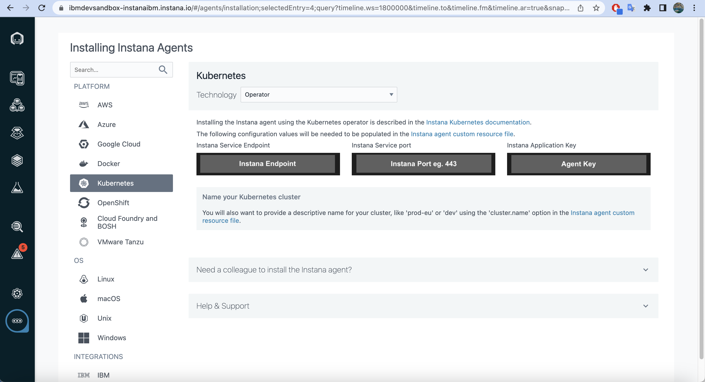

# IBM® Instana® Addon for Amazon EKS Blueprints

The IBM® Instana® Addon for Amazon EKS Blueprints is designed to enhance observability, monitoring, and management capabilities for applications running on Amazon Elastic Kubernetes Service (EKS). IBM Instana collects data from monitored systems by using a single agent on each host. The agent runs on your hosts to collect and aggregate data from various sensors before it sends the data to the Instana backend.

The IBM® Instana® [Addon](https://www.npmjs.com/package/%40instana/aws-eks-blueprint-addon) focuses on enhancing the user experience by reducing the complexity and time required to install and configure an Instana host agent on Amazon EKS cluster. Once you configure the addon for a Amazon EKS blueprints, it will be automatically provisioned during deployment.

This Addon will use IBM Instana Kubernetes operator in the namespace ```instana-agent``` to install and manage the Instana agent. It also configures custom resource values to configure the operator.

## Prerequisites

Ensure that you have installed the following tools on your machine.

1. [aws cli](https://docs.aws.amazon.com/cli/latest/userguide/install-cliv2.html)
2. [kubectl](https://Kubernetes.io/docs/tasks/tools/)
3. [cdk](https://docs.aws.amazon.com/cdk/v2/guide/getting_started.html#getting_started_install)
4. [npm](https://docs.npmjs.com/cli/v8/commands/npm-install)
5. Instana backend application - Use SaaS (eg [aws](https://aws.amazon.com/marketplace/pp/prodview-hnqy5e3t3fzda?sr=0-1&ref_=beagle&applicationId=AWSMPContessa)) or Install self-hosted Instana backend ([on-premises](https://www.ibm.com/docs/en/instana-observability/current?topic=installing-configuring-self-hosted-instana-backend-premises))

## Installation

To create a new project and install dependencies, follow these steps from Amazon EKS Blueprints [Quick Start](https://aws-quickstart.github.io/cdk-eks-blueprints/getting-started)

Use following command to Install IBM Instana Addon:

```shell
npm i @instana/aws-eks-blueprint-addon
```

## Instana Agent Configuration
Go to your Instana installation (Instana User Interface), click ... More > Agents > Installing Instana Agents and select 'Kubernetes' platform to get the Instana Agent Key, Instana Service Endpoint, Instana Service port. These steps are also described [here](https://www.ibm.com/docs/en/instana-observability/218?topic=instana-endpoints-keys) or in the screenshot below.



## AWS Secret Manager Secrets (Optional)
If you wish to use AWS Secret Manager Secrets to pass Instana props (key, endpoint, and port), then you will be required to setup Secrets first.

To create AWS Secret Manager secrets, you can follow these steps:

1. Log in to the AWS Management Console and open the AWS Secret Manager service.
2. Search and Select AWS Secrets Manager service.
3. Select the type of secret as 'Other type of secret'
4. Under the Key/value pairs add following keys and their values:
```
INSTANA_AGENT_KEY=<instana key>
INSTANA_ENDPOINT_HOST_URL=<instana backend host>
INSTANA_ENDPOINT_HOST_PORT=<instana backend port>
```
5. Assign a name to the Secret (eg. *instana-secret-param*).

## Usage : Using AWS Secret Manager Secrets 
```typescript
import 'source-map-support/register';
import * as cdk from 'aws-cdk-lib';
import * as blueprints from '@aws-quickstart/eks-blueprints';
import { loadYaml } from '@aws-quickstart/eks-blueprints/dist/utils';
import { InstanaOperatorAddon } from '@instana/aws-eks-blueprint-addon';

const app = new cdk.App();

export const instanaProps = {
	// In this example, the secret is called instana-secret-param
    secretParamName: '<instana-secret-param>'
};

const yamlObject = loadYaml(JSON.stringify(instanaProps));

// AddOns for the cluster.
const addOns: Array<blueprints.ClusterAddOn> = [
    new InstanaOperatorAddon(yamlObject)
];

const account = '<aws account id>';
const region = '<aws region>';

blueprints.EksBlueprint.builder()
    .account(account)
    .region(region)
    .addOns(...addOns)
    .useDefaultSecretEncryption(true)
    .build(app, '<eks cluster name>');
```

## Usage : Using Secrets in the Code
```typescript
import 'source-map-support/register';
import * as cdk from 'aws-cdk-lib';
import * as blueprints from '@aws-quickstart/eks-blueprints';
import { loadYaml } from '@aws-quickstart/eks-blueprints/dist/utils';
import { InstanaOperatorAddon } from '@instana/aws-eks-blueprint-addon';

const app = new cdk.App();

export const instanaProps = {
	agent: {
    	key: "<instana agent key>", // Mandatory Parameter
    	endpointHost: "<instana backend host>",// Mandatory Parameter
    	endpointPort: "<instana backend port>",// Mandatory Parameter
	}
};

const yamlObject = loadYaml(JSON.stringify(instanaProps));

// AddOns for the cluster.
const addOns: Array<blueprints.ClusterAddOn> = [
    new InstanaOperatorAddon(yamlObject)
];

const account = '<aws account id>';
const region = '<aws region>';

blueprints.EksBlueprint.builder()
    .account(account)
    .region(region)
    .addOns(...addOns)
    .useDefaultSecretEncryption(true)
    .build(app, '<eks cluster name>');
```

## AddOn Configuration Options
| Option                  | Description                                         | Default                       |
|-------------------------|-----------------------------------------------------|-------------------------------|
| `agent.endpointHost`                | Instana Agent backend endpoint host                                | https://ingress-red-saas.instana.io/ (US and ROW)                            |
| `agent.endpointPort`                | Instana Agent backend endpoint port                                | "443"                            |
| `agent.key`  | Your Instana Agent key             | nil                            |
| `agent.downloadKey`  | Your Instana Download key             | nil                            |
| `agent.env`       | Additional environment variables for the agent    | {}                            |
| `agent.configuration_yaml`       | Custom content for the agent configuration.yaml file    | nil                            |
| `cluster.name`             | Display name of the monitored cluster    | "Value of zone.name"                     |
| `zone.name`               | Zone that detected technologies will be assigned to               | nil                     |

## Bootstraping
Bootstrap your environment with the following command.

```shell
cdk bootstrap
```

and finally you can deploy the stack with the following command.
```shell
cdk deploy
```

## Verify the resources
Run update-kubeconfig command. You should be able to get the command from CDK output message. More information can be found [here](https://aws-quickstart.github.io/cdk-eks-blueprints/getting-started/#cluster-access).

```console
aws eks update-kubeconfig --name <your cluster name> --region <your region> --role-arn arn:aws:iam::xxxxxxxxx:role/eks-blue1-eksblue1AccessRole32C5DF05-1NBFCH8INI08A
```

## Testing
To validate if Instana Agent configured properly in Amazon EKS. You can run the following command after Amazon EKS cluster in deployed and running.
```shell
kubectl get pods -n instana-agent
```
Output of the above command will be silimar to below one:

```output
NAMESPACE       NAME                                  				READY   	STATUS    RESTARTS   AGE
instana-agent   controller-manager-78479cb596-sktg9   	1/1     	Running   					0          56m
instana-agent   controller-manager-78479cb596-xz8kn   	1/1     	Running   					0          56m
instana-agent   instana-agent-gsqx8                   				1/1     	Running   					0          56m
```

Run following command to verify Instana Agent logs
```shell
kubectl logs <instana-agent-pod-name> -n instana-agent # Output shows instana agent logs. pod name in this example is instana-agent-gsqx8
```

Once you see Instana Agent is running in your Amazon EKS Cluster, you can go to Instana Installation (User Interface) to get the APM metrices.


## Cleanup

To clean up your EKS Blueprints, run the following commands:

```sh
cdk destroy
```

## Disclaimer 
This pattern relies on an open source NPM package eks-blueprints-cdk-kubeflow-ext. Please refer to the package npm site for more information.
```
https://www.npmjs.com/package/@instana/aws-eks-blueprint-addon'
```