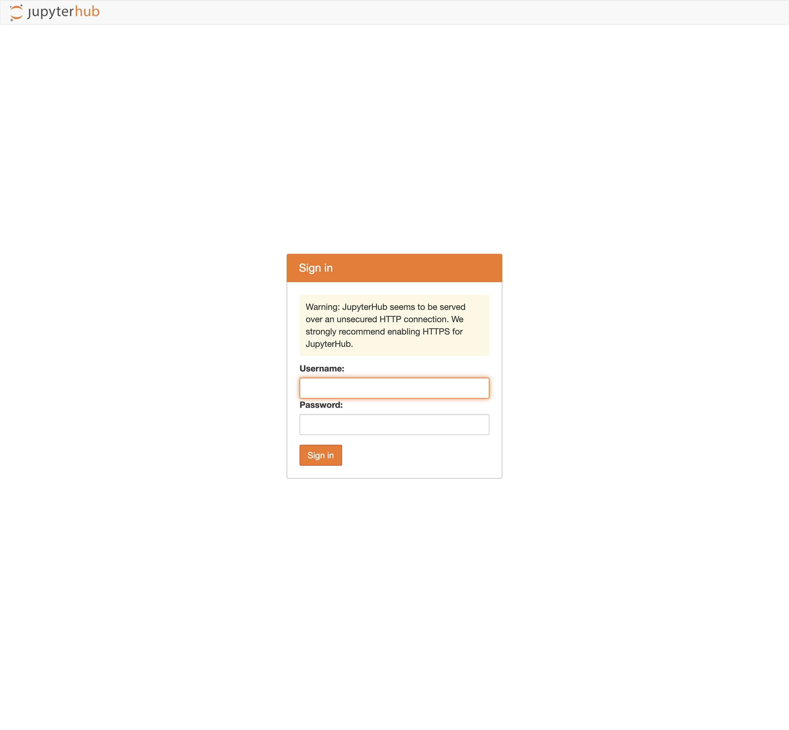

# JupyterHub Add-on

JupyterHub add-on is based on the [JupyterHub](https://github.com/jupyterhub/jupyterhub) project that supports a multi-user Hub to spawn, manage, and proxy multiple instances of single user Jupyter notebook server.

The Hub can offer notebook servers to a class of students, a corporate data science workgroup, a scientific research project, or a high-performance computing group.

For more information regarding a Jupyter notebook, please consult the [official documentation](https://jupyter-notebook.readthedocs.io/en/stable/notebook.html).

***IMPORTANT***: This add-on depends on [EBS CSI Driver](ebs-csi-driver.md) Add-on for using EBS as persistent storage.

***EBS CSI Driver or EFS CSI Driver add-on must be present in add-on array*** and ***must be in add-on array before the Jupyter add-on*** for it to work, as shown in below example (with EBS). Otherwise will run into error `Assertion failed: Missing a dependency for <EbsCsiDriverAddOn or EfsCsiDriverAddOn>`.

## Usage

```typescript
import 'source-map-support/register';
import * as cdk from 'aws-cdk-lib';
import * as blueprints from '@aws-quickstart/eks-blueprints';

const app = new cdk.App();

const jupyterHubAddOn = new blueprints.addons.JupyterHubAddOn({
  ebsConfig: {
    storageClass: "gp2",
    capacity: "4Gi",
  },
  oidcConfig?: {
    callbackUrl: "<Callback URL>",
    authUrl: "<Authorization URL>",
    tokenUrl: "<Token URL>",
    userDataUrl: "<User Data URL>",
    clientId: "<Client ID>",
    clientSecret: "<Client Secret>",
    scope: [], //list of OIDC provider scopes
    usernameKey: "<username key>",
  },
  enableIngress?: true,
  notebookStack: 'jupyter/datascience-notebook'
});

const ebsCsiAddOn = new blueprints.addons.EbsCsiDriverAddOn();
const addOns: Array<blueprints.ClusterAddOn> = [ ebsCsiAddOn, jupyterHubAddOn ];

const blueprint = blueprints.EksBlueprint.builder()
  .addOns(...addOns)
  .build(app, 'my-stack-name');
```

To validate that the JupyterHub add-on is running ensure that the add-on deployments for the controller and the webhook are in `RUNNING` state:

```bash
# Assuming add-on is installed in the jupyterhub.
$ kubectl get po -n jupyterhub
NAME                              READY   STATUS    RESTARTS   AGE
continuous-image-puller-2skff     1/1     Running   0          23m
continuous-image-puller-m6s5f     1/1     Running   0          23m
hub-7dc8888f68-67hnl              1/1     Running   0          23m
jupyter-admin                     1/1     Running   0          16m
proxy-5df778944c-brrbf            1/1     Running   0          23m
user-scheduler-7dbd789bc4-8zrjs   1/1     Running   0          23m
user-scheduler-7dbd789bc4-gcb8z   1/1     Running   0          23m
```

## Functionality

1. Deploys the jupyterhub helm chart in `jupyterhub` namespace by default.
2. JupyterHub is backed with persistent storage. You must provide ***one (and only one)*** of the following configuration (or otherwise will receive an error):
  - Leverage EBS as persistent storage with storage type and capacity provided. If you provide this configuration, ***EBS CSI Driver add-on must be present in add-on array*** and ***must be in add-on array before the JupyterHub add-on*** for it to work, as shown in above example. Otherwise it will not work.
  - Leverage EFS as persistent storage with the name, capacity and file system removal policy provided. If you provide this configuration, ***EFS CSI Driver add-on must be present in add-on array*** and ***must be in add-on array before the JupyterHub add-on*** for it to work, as shown in above example. Otherwise it will not work.
3. (Optional) Leverage OIDC Provider as a way to manage authentication and authorization. If not provided, the default creates no user, and the user will be able to login with any arbitrary username and password. **It is highly recommended to leverage an Identity provider for any production use case.**
4. (Optional) Leverage a different notebook stack than the standard one provided. Jupyter team maintains a set of Docker image definition in a GitHub repository as explained [here](https://jupyter-docker-stacks.readthedocs.io/en/latest/using/selecting.html).
4. Supports [standard helm configuration options](./index.md#standard-helm-add-on-configuration-options).

***Note***: For custom helm values, please consult the [official documentation](https://zero-to-jupyterhub.readthedocs.io/en/latest/resources/reference.html#). 

## Using JupyterHub

JupyterHub, by default, creates a proxy that is exposed to a `LoadBalancer` type Kubernetes service, which will integrate with AWS Load Balancer as indicated when running the following command:

```bash
kubectl get svc -n jupyterhub
NAME           TYPE           CLUSTER-IP      EXTERNAL-IP                                                               PORT(S)        AGE
hub            ClusterIP      172.20.171.28   <none>                                                                    8081/TCP       26m
proxy-api      ClusterIP      172.20.31.32    <none>                                                                    8001/TCP       26m
proxy-public   LoadBalancer   172.20.14.210   xxxxxxxx-1234567890.us-west-2.elb.amazonaws.com   80:32733/TCP   26m
```

You can log into the JupyterHub portal by accessing the Load Balancer endpoint in any browser. 



A default arbirary username with password can be entered to log in. Once logged in, you should be able to access the main portal page.


As stated above, **it is highly recommended to leverage an Identity provider for any production use case.** Please consult the official guide [here](https://zero-to-jupyterhub.readthedocs.io/en/latest/administrator/authentication.html#oauth2-based-authentication) for various OAuth2 based authentication methods.