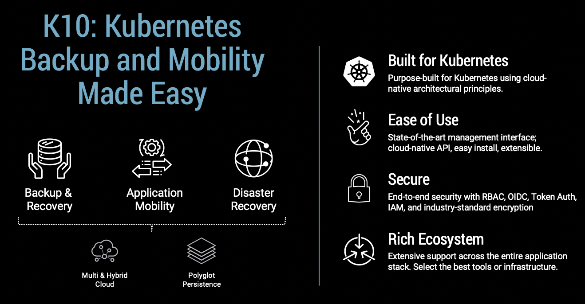
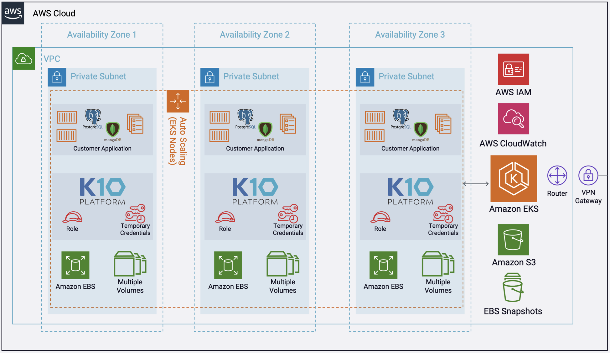
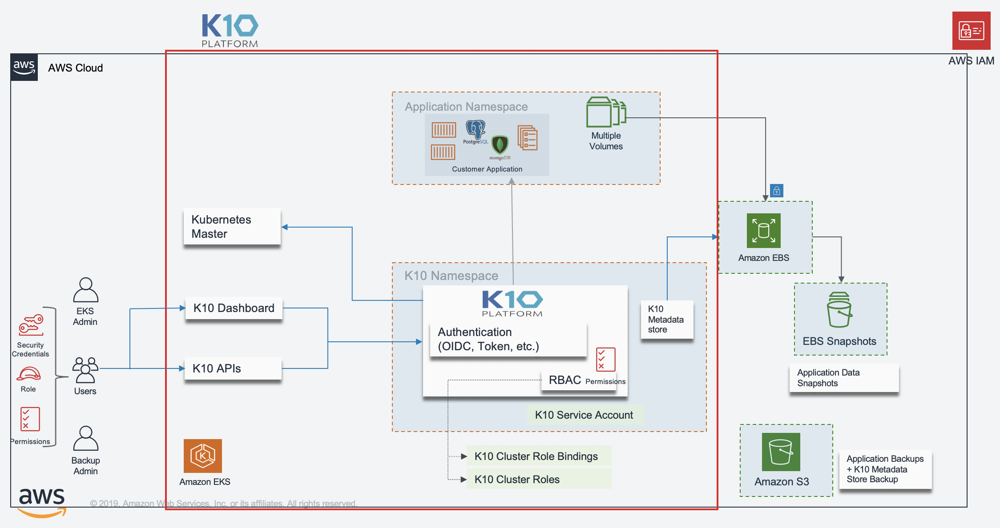

# Kasten K10 Add-On

**Kasten K10 by Veeam Overview**

The K10 data management platform, purpose-built for Kubernetes, provides enterprise operations teams an easy-to-use, scalable, and secure system for backup/restore, disaster recovery, and mobility of Kubernetes applications.

K10’s application-centric approach and deep integrations with relational and NoSQL databases, Amazon EKS and AWS Services provides teams the freedom of infrastructure choice without sacrificing operational simplicity. Policy-driven and extensible, K10 provides a native Kubernetes API and includes features such full-spectrum consistency, database integrations, automatic application discovery, application mobility, and a powerful web-based user interface.

Given K10’s extensive ecosystem support you have the flexibility to choose environments (public/ private/ hybrid cloud/ on-prem) and Kubernetes distributions (cloud vendor managed or self managed) in support of three principal use cases:

-   [Backup and Restore](https://www.kasten.io/kubernetes/use-cases/backup-restore)
    
-   [Disaster Recovery](https://www.kasten.io/kubernetes/use-cases/disaster-recovery/)
    
-   [Application Mobility](https://www.kasten.io/kubernetes/use-cases/application-mobility/)


The Kasten K10 add-on installs Kasten K10 into your Amazon EKS cluster. 

## Architecture
Deploying this Quick Start for a new virtual private cloud (VPC) with default parameters builds the following K10 platform in the AWS Cloud. The diagram shows three Availability Zones, leveraging multiple AWS services.

More detailed K10 architecture diagram is shown below.

## Usage

```typescript
import * as cdk from '@aws-cdk/core';
import * as ssp from '../lib';

const app = new cdk.App();

const addOns: Array<ssp.ClusterAddOn> = [
  new ssp.addons.KastenK10AddOn(),
];

new ssp.EksBlueprint(
    app, 
    {
        id: 'my-stack-name', 
        addOns,
    },
    {
        env:{
          account: <AWS_ACCOUNT_ID>,
          region: <AWS_REGION>, 
        }       
    });
```

## Functionality

1. Create the IAM Role for Service Account for Kasten K10 pod to make API calls to AWS S3 and EC2 to backup and restore.
2. Installs Kasten K10 in a new namespace "kasten-io".

The IAM Policy is as follows:

```
    "Version": "2012-10-17",
    "Statement": [
        {
            "Effect": "Allow",
            "Action": [
                "ec2:CopySnapshot",
                "ec2:CreateSnapshot",
                "ec2:CreateTags",
                "ec2:CreateVolume",
                "ec2:DeleteTags",
                "ec2:DeleteVolume",
                "ec2:DescribeSnapshotAttribute",
                "ec2:ModifySnapshotAttribute",
                "ec2:DescribeAvailabilityZones",
                "ec2:DescribeSnapshots",
                "ec2:DescribeTags",
                "ec2:DescribeVolumeAttribute",
                "ec2:DescribeVolumesModifications",
                "ec2:DescribeVolumeStatus",
                "ec2:DescribeVolumes"
            ],
            "Resource": "*"
        },
        {
            "Effect": "Allow",
            "Action": "ec2:DeleteSnapshot",
            "Resource": "*",
            "Condition": {
                "StringLike": {
                    "ec2:ResourceTag/Name": "Kasten: Snapshot*"
                }
            }
        },
        {
            "Effect": "Allow",
            "Action": [
                "s3:CreateBucket",
                "s3:PutObject",
                "s3:GetObject",
                "s3:PutBucketPolicy",
                "s3:ListBucket",
                "s3:DeleteObject",
                "s3:DeleteBucketPolicy",
                "s3:GetBucketLocation",
                "s3:GetBucketPolicy"
            ],
            "Resource": "*"
        }
    ]
}

```


## Validating the Install

To validate that K10 has been installed properly, the following command can be run in K10's namespace (the install default is `kasten-io`) to watch for the status of all K10 pods:

kubectl get pods --namespace kasten-io --watch

It may take a couple of minutes for all pods to come up but all pods should ultimately display the status of `Running`.
```
kubectl get pods --namespace kasten-io
NAMESPACE     NAME                                    READY   STATUS    RESTARTS   AGE
kasten-io     aggregatedapis-svc-b45d98bb5-w54pr      1/1     Running   0          1m26s
kasten-io     auth-svc-8549fc9c59-9c9fb               1/1     Running   0          1m26s
kasten-io     catalog-svc-f64666fdf-5t5tv             2/2     Running   0          1m26s
```

In the unlikely scenario that pods that are stuck in any other state, please follow the [support](https://docs.kasten.io/latest/operating/support.html#support) documentation to debug further.

### Validate Dashboard Access

By default, the K10 dashboard will not be exposed externally. To establish a connection to it, use the following `kubectl` command to forward a local port to the K10 ingress port:

``kubectl --namespace kasten-io port-forward service/gateway 8080:8000``

The K10 dashboard will be available at  [http://127.0.0.1:8080/k10/#/](http://127.0.0.1:8080/k10/#/).

For a complete list of options for accessing the Kasten K10 dashboard through a LoadBalancer, Ingress or OpenShift Route you can use the instructions [here](https://docs.kasten.io/latest/access/dashboard.html#dashboard).


## Backup and Recovery of a Kubernetes Application

Kasten K10 Dashboard Overview

The K10 dashboard is broken up into several different sections. A brief description is provided in the sections below.


It is also possible to perform an interactive walk-through of the K10 dashboard via a Guided Tour. The tour is available when the K10 dashboard is accessed for the first time or via the Dashboard option on the [Settings](https://docs.kasten.io/latest/usage/overview.html#k10-settings) page.

System Overview

The top of the K10 dashboard displays a list of applications (currently mapped to namespaces), any policies that might exist in the system, and a summary of the cluster's backup data footprint.


After filtering to only include applications that have stateful services (defined as containing a persistent volume), the above screen breaks down each section into three categories:

**Unmanaged**: There are no protection policies that cover this object

**Non-compliant**: A policy applies to this object but the actions associated with the policy are failing (e.g., due to underlying storage slowness, configuration problems, etc.) or the actions haven't been invoked yet (e.g., right after policy creation)

**Compliant**: Objects that both policies apply to and the policy SLAs are being respected

**Applications, Namespaces, and Workloads**

The K10 platform by default equates names to applications for ease of use and consistency with Kubernetes best practices, use of RBAC, and to mirror the most common application deployment pattern. However, as shown later, policies can be defined to operate on more than one namespace or only operate on a subset of an application residing in a single namespace.

Assuming you have already installed applications, clicking on the Applications card on the dashboard will take you to the following view. Note that if you clicked on one of the Compliant/Non-Compliant/Unmanaged buttons, it would automatically filter the below view for you.


An application, in turn, is made up of multiple Kubernetes resources and workloads including deployments and stateful sets.


**Policies**


Within K10, policies are used to automate your data management workflows. Going back to the main dashboard, you will find a section on how to manage policies right next to the Applications card. To achieve this, they combine actions you want to take (e.g., snapshot), a frequency or schedule for how often you want to take that action, and selection criteria for the resources you want to manage.


If you click on the Policies card, you will notice in the above screenshot that no default policies are created at install time but a policy can be either created from this page or from the application page shown earlier.

**Creating a Location Profile**

K10 can usually invoke protection operations such as snapshots within a cluster without requiring additional credentials. While this might be sufficient if K10 is running in some of (but not all) the major public clouds and if actions are limited to a single cluster, it is **not** sufficient for essential operations such as performing real backups, enabling cross-cluster and cross-cloud application migration, and enabling DR of the K10 system itself.

To enable these actions that span the lifetime of any one cluster, K10 needs to be configured with access to external object storage or external NFS file storage. This is accomplished via the creation of Location Profiles.


Profile creation can be accessed from the Settings icon in the top-right corner of the dashboard or via the [CRD-based Profiles API](https://docs.kasten.io/latest/api/profiles.html#api-profile).

Location profiles are used to create backups from snapshots, move applications and their data across clusters and potentially across different clouds, and to subsequently import these backups or exports into another cluster. To create a location profile, click New Profile on the profiles page.


**Object Storage Location**

As mentioned above, exporting or importing data requires an object storage location. You are therefore required to pick an object storage provider, a region for the bucket if being used in a public cloud, and the bucket name. If a bucket with the given name does not exist, it will be created.

If an S3-compatible object storage system is used that is not hosted by one of the supported cloud providers, an S3 endpoint URL will need to be specified and optionally, SSL verification might need to be disabled. Disabling SSL verification is only recommended for test setups.

*Note*

When certain cloud providers (e.g., AWS) are selected, provider-specific options (e.g., IAM Roles) will appear for configuration if needed.

When Validate  and  Save is selected, the config profile will be created and a profile similar to the following will appear:


**Protecting Applications**

Protecting an application with K10, usually accomplished by creating a policy, requires the understanding and use of three concepts:

**Snapshots and Backups**: Depending on your environment and requirement, you might need just one or both of these data capture mechanisms

**Scheduling**: Specification of application capture frequency and snapshot/backup retention objectives

**Selection**: This defines not just which applications are protected by a policy but, whenever finer-grained control is needed, resource filtering can be used to restrict what is captured on a per-application basis

This section demonstrates how to use these concepts in the context of a K10 policy to protect applications. Today, an application for K10 is defined as a collection of namespaced Kubernetes resources (e.g., ConfigMaps, Secrets), relevant non-namespaced resources used by the application (e.g., StorageClasses), Kubernetes workloads (i.e., Deployments, StatefulSets, OpenShift DeploymentConfigs, and standalone Pods), deployment and release information available from Helm v3, and all persistent storage resources (e.g., PersistentVolumeClaims and PersistentVolumes) associated with the workloads.

While you can always create a policy from scratch from the policies page, the easiest way to define policies for unprotected applications is to click on the Applications card on the main dashboard. This will take you to a page where you can see all applications in your Kubernetes cluster.


To protect any unmanaged application, simply click Create  a  policy and, as shown below, that will take you to the policy creation section with an auto-populated policy name that you can change. The concepts highlighted above will be described in the below sections in the context of the policy creation workflow.


**Snapshots and Backups**

All policies center around the execution of _actions_ and, for protecting applications, you start by selecting the snapshot action with an optional backup (currently called export) option to that action.

### **Snapshots**


### Backups


## Scheduling

There are four components to scheduling:

 - How frequently the primary snapshot action should be performed
 - How often snapshots should be exported into backups 
 - Retention schedule of snapshots and backups
 - When the primary snapshot action should be performed

### Action Frequency


Actions can be set to execute at an hourly, daily, weekly, monthly, or yearly granularity, or on demand. By default, actions set to hourly will execute at the top of the hour and other actions will execute at midnight UTC.

It is also possible to select the time at which scheduled actions will execute and sub-frequencies that execute multiple actions per frequency. See [Advanced Schedule Options](https://docs.kasten.io/latest/usage/protect.html#advanced-schedule-options) below.

Sub-hourly actions are useful when you are protecting mostly Kubernetes objects or small data sets. Care should be taken with more general-purpose workloads because of the risk of stressing underlying storage infrastructure or running into storage API rate limits. Further, sub-frequencies will also interact with retention (described below). For example, retaining 24 hourly snapshots at 15-minute intervals would only retain 6 hours of snapshots.

### Snapshot Exports to Backups


Backups performed via exports, by default, will be set up to export every snapshot into a backup. However, it is also possible to select a subset of snapshots for exports (e.g., only convert every daily snapshot into a backup).

### Retention Schedules


A powerful scheduling feature in K10 is the ability to use a [GFS retention scheme](https://en.wikipedia.org/wiki/Backup_rotation_scheme#Grandfather-father-son) for cost savings and compliance reasons. With this backup rotation scheme, hourly snapshots and backups are rotated on an hourly basis with one graduating to daily every day and so on. It is possible to set the number of hourly, daily, weekly, monthly, and yearly copies that need to be retained and K10 will take care of both cleanup at every retention tier as well as graduation to the next one. For on demand policies it is not possible to set a retention schedule.


By default, backup retention schedules will be set to be the same as snapshot retention schedules but these can be set to independent schedules if needed. This allows users to create policies where a limited number of snapshots are retained for fast recovery from accidental outages while a larger number of backups will be stored for long-term recovery needs. This separate retention schedule is also valuable when limited number of snapshots are supported on the volume but a larger backup retention count is needed for compliance reasons.

The retention schedule for a policy does not apply to snapshots and backups produced by [manual policy runs](https://docs.kasten.io/latest/usage/protect.html#manual-policy-runs). Any artifacts created by a manual policy run will need to be manually cleaned up. Snapshots and backups created by scheduled runs of a policy can be retained and omitted from the retention counts by adding a k10.kasten.io/doNotRetire:  "true" label to the [RunAction](https://docs.kasten.io/latest/api/actions.html#api-run-action) created for the policy run.

### Advanced Schedule Options


By default, actions set to hourly will execute at the top of the hour and other actions will execute at midnight UTC.

The Advanced  Options settings enable picking how many times and when actions are executed within the interval of the frequency. For example, for a daily frequency, what hour or hours within each day and what minute within each hour can be set.


The retention schedule for the policy can be customized to select which snapshots and backups will graduate and be retained according to the longer period retention counts.

By default, hourly retention counts apply to the hourly at the top of the hour, daily retention counts apply to the action at midnight, weekly retention counts refer to midnight Sunday, monthly retention counts refer to midnight on the 1st of each month, and yearly retention counts refer to midnight on the 1st of January (all UTC).

When using sub-frequencies with multiple actions per period, all of the actions are retained according to the retention count for that frequency.

The Advanced Options settings allows a user to display and enter times in either local time or UTC. All times are converted to UTC and K10 policy schedules do not change for daylight savings time.

Application Selection and Exceptions

This section describes how policies can be bound to applications, how namespaces can be excluded from policies, how policies can protect cluster-scoped resources, and how exceptions can be handled.

### Application Selection

You can select applications by two specific methods:

 - Application Names
 - Labels

#### Selecting By Application Name


The most straightforward way to apply a policy to an application is to use its name (which is derived from the namespace name). Note that you can select multiple application names in the same policy.

#### Selecting By Application Name Wildcard


For policies that need to span similar applications, you can select applications by an application name wildcard. Wildcard selection will match all application that start with the wildcard specified.


For policies that need to span all applications, you can select all applications with a * wildcard.

#### Selecting No Applications


For policies that protect only cluster-scoped resources and do not target any applications, you can select "None". For more information about protecting cluster-scoped resources, see [Cluster-Scoped Resources](https://docs.kasten.io/latest/usage/clusterscoped.html#clusterscoped).

#### Selecting By Labels


For policies that need to span multiple applications (e.g., protect all applications that use MongoDB or applications that have been annotated with the _gold_ label), you can select applications by label. Any application (namespace) that has a matching label as defined in the policy will be selected. Matching occurs on labels applied to namespaces, deployments, and statefulsets. If multiple labels are selected, a union (logical OR) will be performed when deciding to which applications the policy will be applied. All applications with at least one matching label will be selected.

Note that label-based selection can be used to create forward-looking policies as the policy will automatically apply to any future application that has the matching label. For example, using the heritage:  Tiller (Helm v2) or heritage:  Helm (Helm v3) selector will apply the policy you are creating to any new Helm-deployed applications as the Helm package manager automatically adds that label to any Kubernetes workload it creates.

**Working With Policies**

Once you have created a policy and have navigated back to the main dashboard, you will see the selected applications quickly switch from unmanaged to non-compliant (i.e., a policy covers the objects but no action has been taken yet). They will switch to compliant as snapshots and backups are run as scheduled or manually and the application enters a protected state. You can also scroll down on the page to see the activity, how long each snapshot took, and the generated artifacts. Your page will now look similar to this:


More detailed job information can be obtained by clicking on the in-progress or completed jobs.

### Manual Policy Runs


It is possible to manually create a policy run by going to the policy page and clicking the run  once button on the desired policy. Note that any artifacts created by this action will not be eligible for automatic retirement and will need to be manually cleaned up.

[Restoring Existing Applications](https://docs.kasten.io/latest/usage/restore.html#id1)

Restoring an application is accomplished via the Applications page. One needs to simply click the Restore icon.


*Note*

While the UI uses the Export term for backups, no Import policy is needed to restore from a backup. Import policies are only needed when you want to restore the application into a different cluster.

At that point, one has the option to pick a restore point, a grouped collection of data artifacts belonging to the application, to restore from. As seen above, this view distinguishes manually generated restore points from automated policy-generated ones.

It also distinguishes between snapshots and backups. When both are present, as seen above, a layered box is shown to indicate more than one kind of restore point is present for the same data. If you want to restore a version of the application stack, clicking on the layered restore point will present the below option to select between the local snapshot and exported backup.


Selecting a restore point will bring up a side-panel containing more details on the restore point for you to preview, if needed, before you initiate an application restore.


Note

Restored PersistentVolumes may not have the annotations specified in the original PersistentVolume.

After the restore completes, you will be able to go back to your application and verify that the state was restored to what existed at the time the restore point was obtained.

[Restoring Deleted Applications](https://docs.kasten.io/latest/usage/restore.html#id2)

The process of restoring a deleted application is nearly identical to the above process. The only difference is that, by default, removed applications are not shown on the Applications page. To discover them, you simply need to filter and select Removed.

<

Once the filter is in effect, you will see applications that K10 has previously protected but no longer exist. These can now be restored using the normal restore workflow.


# Support

All certified Kubernetes distributions v1.16 – v1.22 and OpenShift 4.4 - 4.9 are supported by the current K10 release.

If you have questions, need support, please refer to [Kasten K10 Community Support](https://community.veeam.com/groups/kasten-k10-support-92) or open a case via [https://my.veeam.com](https://my.veeam.com) if you’re running a paid version of Kasten K10.

# Additional resources

**AWS services**

[eksctl](https://docs.aws.amazon.com/eks/latest/userguide/eksctl.html)  
  
[aws-iam-authenticator](https://docs.aws.amazon.com/eks/latest/userguide/install-aws-iam-authenticator.html)  
  
**Quick Start reference deployments**

[AWS Quick Start home page](https://aws.amazon.com/quickstart/)

[Amazon EKS Architecture Quick Start](https://aws.amazon.com/quickstart/architecture/amazon-eks/)

  
**Kasten**

[Kasten documentation](https://docs.kasten.io/)
