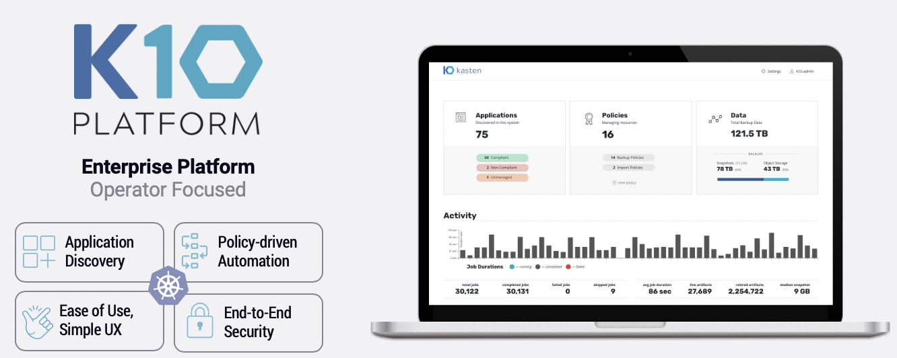

# Kasten K10 Add-On

**Kasten K10 by Veeam Overview**

The K10 data management platform, purpose-built for Kubernetes, provides enterprise operations teams an easy-to-use, scalable, and secure system for backup/restore, disaster recovery, and mobility of Kubernetes applications.

K10’s application-centric approach and deep integrations with relational and NoSQL databases, Amazon EKS and AWS Services provides teams the freedom of infrastructure choice without sacrificing operational simplicity. Policy-driven and extensible, K10 provides a native Kubernetes API and includes features such full-spectrum consistency, database integrations, automatic application discovery, application mobility, and a powerful web-based user interface.

Given K10’s extensive ecosystem support you have the flexibility to choose environments (public/ private/ hybrid cloud/ on-prem) and Kubernetes distributions (cloud vendor managed or self managed) in support of three principal use cases:

-   [Backup and Restore](https://www.kasten.io/kubernetes/use-cases/backup-restore)
    
-   [Disaster Recovery](https://www.kasten.io/kubernetes/use-cases/disaster-recovery/)
    
-   [Application Mobility](https://www.kasten.io/kubernetes/use-cases/application-mobility/)

The Kasten K10 add-on installs Kasten K10 into your Amazon EKS cluster. 



## Usage

```typescript
import * as cdk from '@aws-cdk/core';
import * as ssp from '../lib';

const app = new cdk.App();

const addOns: Array<ssp.ClusterAddOn> = [
  new ssp.addons.KastenK10AddOn(),
];

new ssp.EksBlueprint(
    app, 
    {
        id: 'my-stack-name', 
        addOns,
    },
    {
        env:{
          account: <AWS_ACCOUNT_ID>,
          region: <AWS_REGION>, 
        }       
    });
```

## Functionality

1. Create the IAM Role for Service Account for Kasten K10 pod to make API calls to AWS S3 and EC2 to backup and restore.
2. Installs Kasten K10 in a new namespace "kasten-io".

## Validating the Install

To validate that K10 has been installed properly, the following command can be run in K10's namespace (the install default is `kasten-io`) to watch for the status of all K10 pods:

kubectl get pods --namespace kasten-io --watch

It may take a couple of minutes for all pods to come up but all pods should ultimately display the status of `Running`.
```
kubectl get pods --namespace kasten-io
NAMESPACE     NAME                                    READY   STATUS    RESTARTS   AGE
kasten-io     aggregatedapis-svc-b45d98bb5-w54pr      1/1     Running   0          1m26s
kasten-io     auth-svc-8549fc9c59-9c9fb               1/1     Running   0          1m26s
kasten-io     catalog-svc-f64666fdf-5t5tv             2/2     Running   0          1m26s
```

In the unlikely scenario that pods that are stuck in any other state, please follow the [support](https://docs.kasten.io/latest/operating/support.html#support) documentation to debug further.

### Validate Dashboard Access

By default, the K10 dashboard will not be exposed externally. To establish a connection to it, use the following `kubectl` command to forward a local port to the K10 ingress port:

``kubectl --namespace kasten-io port-forward service/gateway 8080:8000``

The K10 dashboard will be available at  [http://127.0.0.1:8080/k10/#/](http://127.0.0.1:8080/k10/#/).

For a complete list of options for accessing the Kasten K10 dashboard through a LoadBalancer, Ingress or OpenShift Route you can use the instructions [here](https://docs.kasten.io/latest/access/dashboard.html#dashboard).
