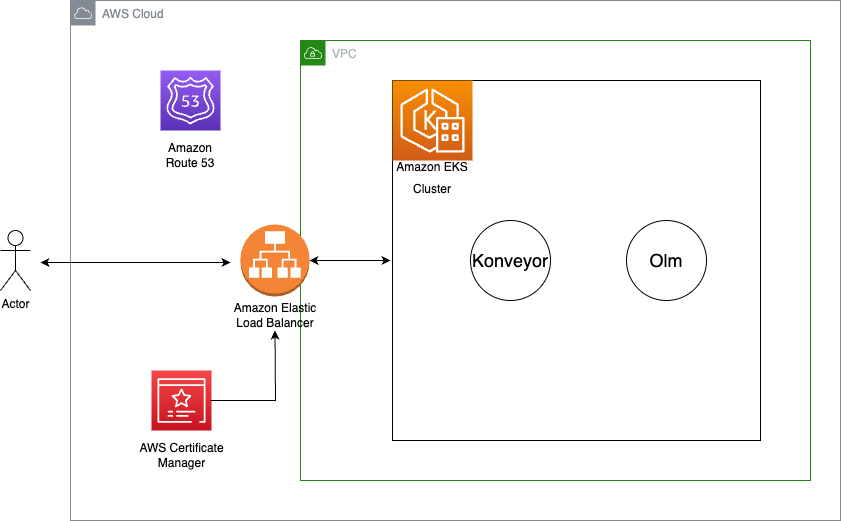
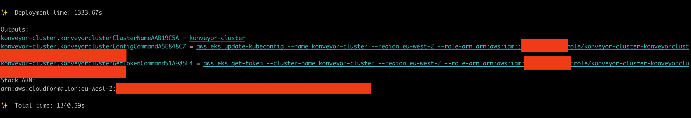
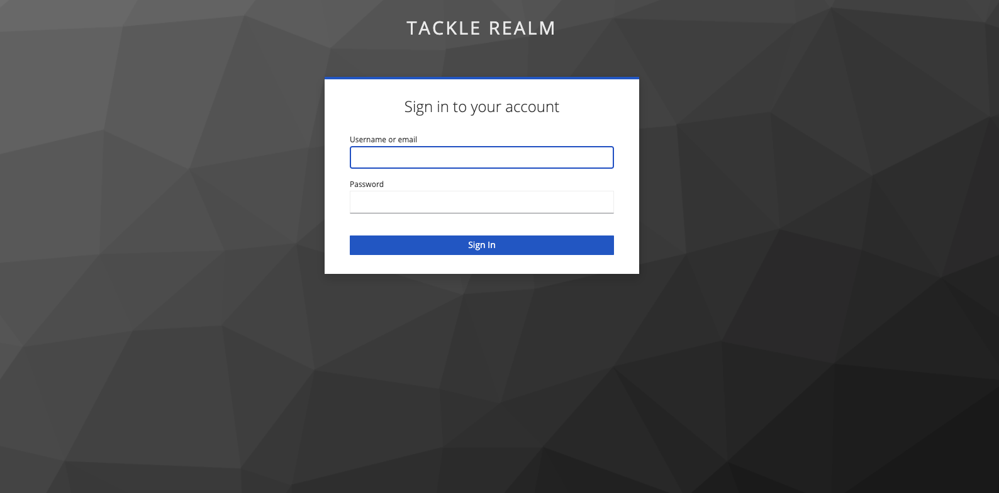
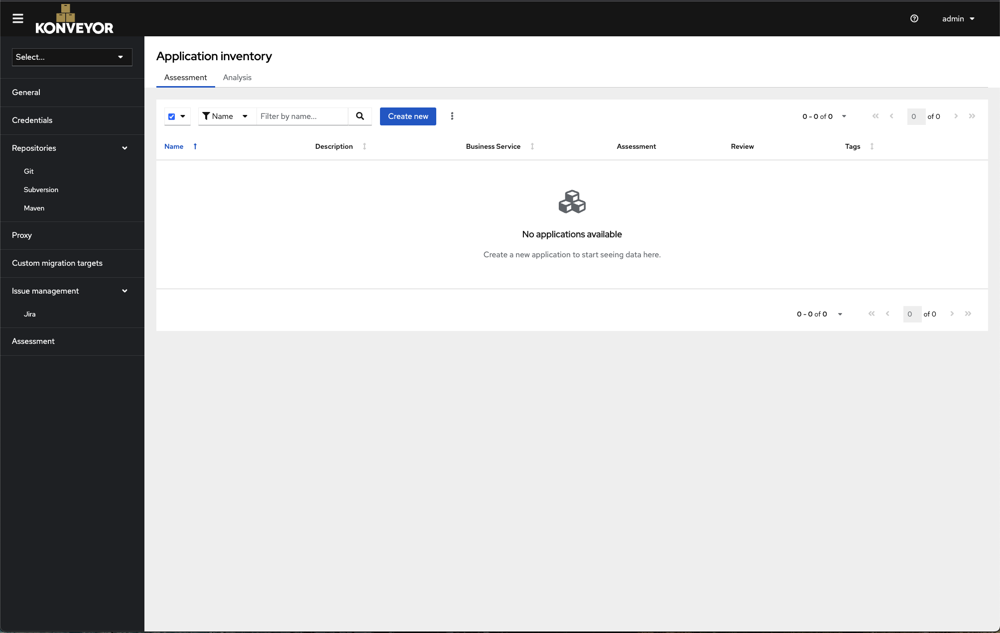

# Konveyor Add-On for Amazon EKS Blueprints

[Konveyor](https://konveyor.github.io/components/konveyor-hub/) is an open-source application modernization platform that helps organizations safely and predictably modernize applications to new technologies, with an initial focus on accelerating the adoption of legacy applications to Kubernetes. Konveyor’s goal is to deliver a Unified Experience to the organizations embarking on their modernization journey. It follows a simple yet effective approach of surfacing the information about the application to aid a ‘Decision Maker’ to make decisions about their modernization and migration needs, plan the work in the form of ‘Migration waves’ and provide guidance to the developers to complete the needed migration/modernization by providing assets as well as a catalog of integrated tools to aid specific workflows.

Feature set

- Konveyor Hub: Central interface from where you manage your application portfolio and integrate with other Konveyor tools.

- Categorize and group applications by different dimensions (pre-packaged or custom) aligned with technical criteria or your organization structure.

- Assess applications containerization suitablity and risks assessment.

- Assign priority, assess estimated migration effort, and define optimal migration strategy for individual applications.

- Evaluate required changes for Java applications containerization through automated analysis (pre-packaged or custom rules).

- Fully integrated Konveyor Data Intensive Validity Advisor (DiVA): Analyzes the data layer of applications and detect dependencies to different data stores and distributed transactions. Import target Java application source files to generate analysis results.

[Konveyor](https://www.konveyor.io/) is an Open Source software developed by the Konveyor Community, and is a [CNCF](https://www.cncf.io/) Sandbox project.

This Open Source solution is packaged by [Claranet Switzerland](https://www.claranet.ch/) GmbH.

## Arhcitecture



## Prerequisites

Ensure that you have installed the following tools on your machine:

- [AWS CLI](https://docs.aws.amazon.com/cli/latest/userguide/install-cliv2.html) (also ensure it is [configured](https://docs.aws.amazon.com/cli/latest/userguide/getting-started-quickstart.html#getting-started-quickstart-new))
- [cdk](https://docs.aws.amazon.com/cdk/v2/guide/getting_started.html#getting_started_install)
- [npm](https://docs.npmjs.com/cli/v8/commands/npm-install)
- [tsc](https://www.typescriptlang.org/download)
- [make](https://www.gnu.org/software/make/)

Let’s start by setting the account and region environment variables:

```sh
ACCOUNT_ID=$(aws sts get-caller-identity --query 'Account' --output text)
AWS_REGION=$(aws configure get region)
```

## Deployment

Clone the repository:

```sh
git clone https://github.com/aws-samples/cdk-eks-blueprints-patterns.git
cd cdk-eks-blueprints-patterns
```

Set the pattern's parameters in the CDK context by overriding the _cdk.json_ file (edit _PARENT_DOMAIN_NAME_ as it fits):

```sh
PARENT_DOMAIN_NAME=example.com
HOSTED_ZONE_ID=$(aws route53 list-hosted-zones-by-name --dns-name $PARENT_DOMAIN_NAME --query "HostedZones[].Id" --output text | xargs basename)
cat << EOF > cdk.json
{
    "app": "npx ts-node dist/lib/common/default-main.js",
    "context": {
        "konveyor.parent.domain.name":"${PARENT_DOMAIN_NAME}",
        "konveyor.hosted.zone.id": "${HOSTED_ZONE_ID}"
      }
}
EOF
```

(Optional) The full list of parameters you can set in the _context_ is:

```
    "context": {
        "konveyor.namespace.name": ...,
        "konveyor.parent.domain.name": ...,
        "konveyor.subdomain.label": ...,
        "konveyor.hosted.zone.id": ...,
        "konveyor.certificate.resource.name": ...,
      }
```

You can assign values to the above keys according to the following criteria (values are required where you don't see _default_ mentioned):

- "konveyor.namespace.name": Konveyor's namespace, the default is "konveyor"
- "konveyor.parent.domain.name": the parent domain in your Hosted Zone
- "konveyor.subdomain.label": to be used as _{"subdomain.label"}.{"parent.domain.name"}_, the default is "backstage"
- "konveyor.hosted.zone.id": the Hosted zone ID (format: 20x chars/numbers)
- "konveyor.certificate.resource.name": resource name of the certificate, registered by the resource provider, the default is "konveyor-certificate"

If you haven't done it before, [bootstrap your cdk account and region](https://docs.aws.amazon.com/cdk/v2/guide/bootstrapping.html).

Run the following commands:

```sh
make deps
make build
make pattern konveyor deploy
```

When deployment completes, the output will be similar to the following:



## Example configuration

```typescript
import { StackProps } from "aws-cdk-lib";
import { Construct } from "constructs";
import * as blueprints from "@aws-quickstart/eks-blueprints";
import {
  KonveyorAddOn,
  OlmAddOn,
} from "@claranet-ch/konveyor-eks-blueprint-addon";

export interface KonveyorConstructProps extends StackProps {
  account: string;
  region: string;
  parentDomain: string;
  konveyorLabel: string;
  hostedZoneId: string;
  certificateResourceName: string;
}

export class KonveyorConstruct extends Construct {
  constructor(scope: Construct, id: string) {
    super(scope, id);

    const props = {
      account: process.env.CDK_DEFAULT_ACCOUNT,
      region: process.env.CDK_DEFAULT_REGION,
      namespace: blueprints.utils.valueFromContext(
        scope,
        "konveyor.namespace.name",
        "konveyor"
      ),
      parentDomain: blueprints.utils.valueFromContext(
        scope,
        "konveyor.parent.domain.name",
        "example.com"
      ),
      konveyorLabel: blueprints.utils.valueFromContext(
        scope,
        "konveyor.subdomain.label",
        "konveyor"
      ),
      hostedZoneId: blueprints.utils.valueFromContext(
        scope,
        "konveyor.hosted.zone.id",
        "1234567890"
      ),
      certificateResourceName: blueprints.utils.valueFromContext(
        scope,
        "konveyor.certificate.resource.name",
        "konveyor-certificate"
      ),
    };

    const subdomain = props.konveyorLabel + "." + props.parentDomain;

    const addOns: Array<blueprints.ClusterAddOn> = [
      new blueprints.AwsLoadBalancerControllerAddOn(),
      new blueprints.VpcCniAddOn(),
      new blueprints.CoreDnsAddOn(),
      new blueprints.KubeProxyAddOn(),
      new blueprints.ExternalDnsAddOn({
        hostedZoneResources: [blueprints.GlobalResources.HostedZone],
      }),
      new blueprints.EbsCsiDriverAddOn(),
      new OlmAddOn(),
      new KonveyorAddOn({
        certificateResourceName: props.certificateResourceName,
        subdomain,
        featureAuthRequired: "true",
      }),
    ];

    const blueprint = blueprints.EksBlueprint.builder()
      .account(props.account)
      .region(props.region)
      .resourceProvider(
        blueprints.GlobalResources.HostedZone,
        new blueprints.ImportHostedZoneProvider(
          props.hostedZoneId,
          props.parentDomain
        )
      )
      .resourceProvider(
        props.certificateResourceName,
        new blueprints.CreateCertificateProvider(
          "elb-certificate",
          subdomain,
          blueprints.GlobalResources.HostedZone
        )
      )
      .addOns(...addOns)
      .build(scope, props.konveyorLabel + "-cluster");
  }
}
```

## Log in

Once the deployment ends navigate to

`https://<subdomain>.<parent-domain>`

And enter the default admin credentials:

- Username: `admin`
- Password: `Passw0rd!`

## Koveyor UI

Login page



Home Page



## Cleanup

To clean up your EKS Blueprints, run the following commands:

```sh
make pattern konveyor destroy
```
