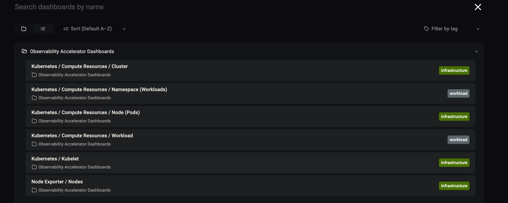
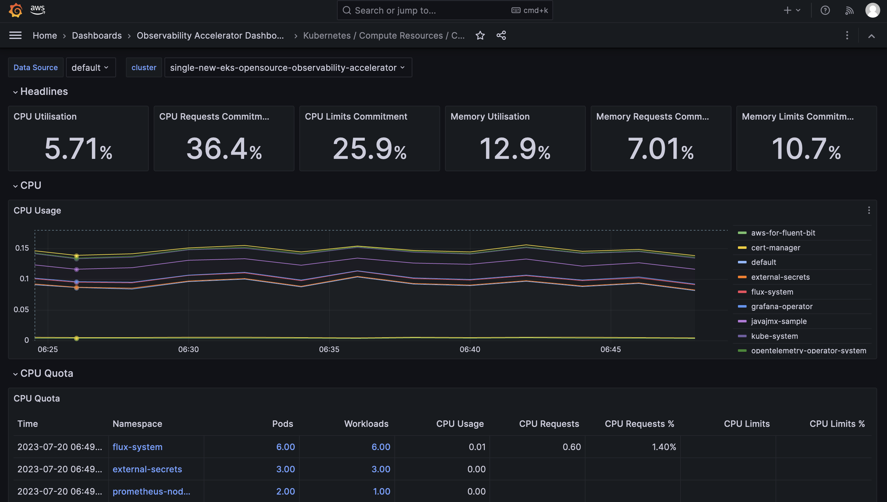
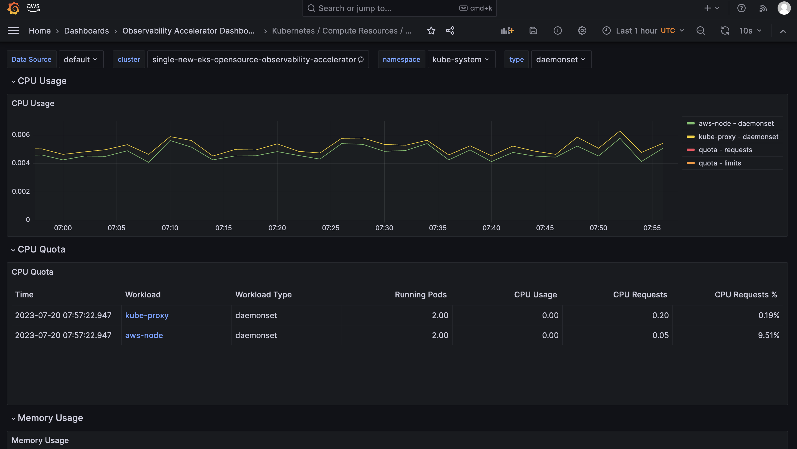
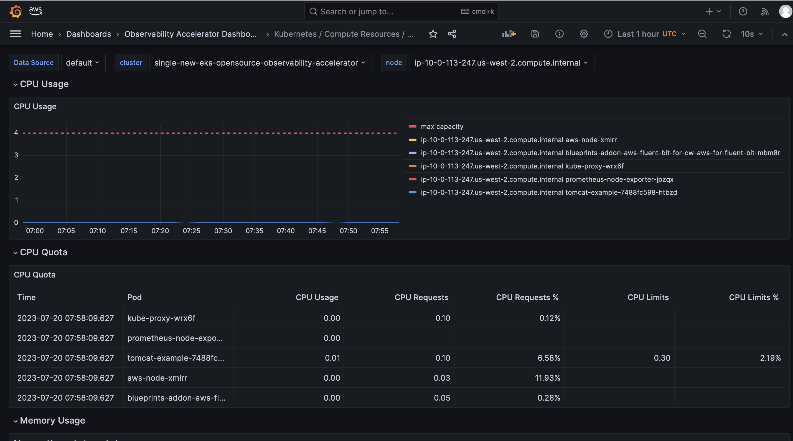
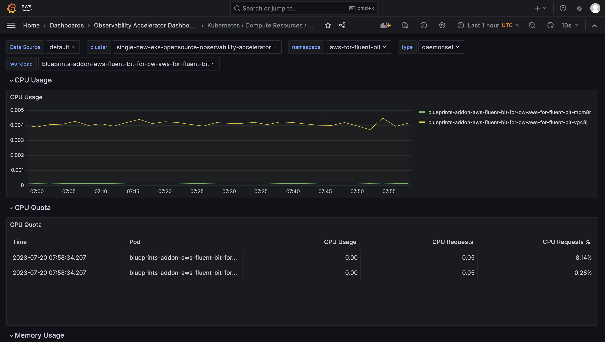
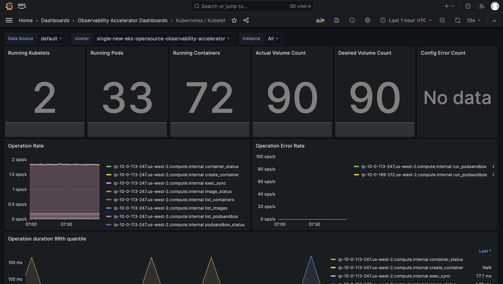
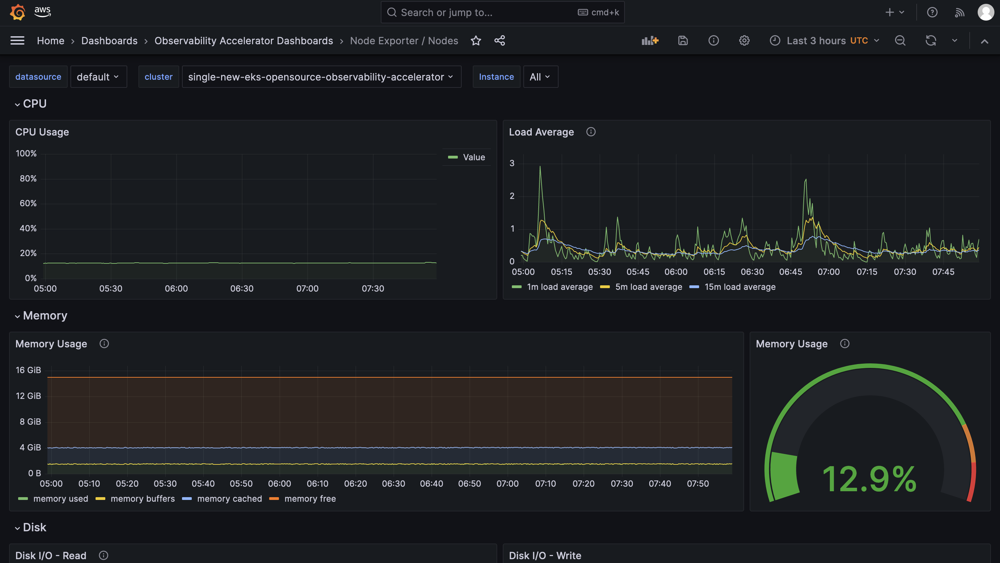

# Neuron Monitor Addon

[Neuron Monitor](https://awsdocs-neuron.readthedocs-hosted.com/en/latest/tools/neuron-sys-tools/neuron-monitor-user-guide.html) collects metrics and stats from the Neuron Applications running on the system and streams the collected data to stdout in JSON format.

These metrics and stats are organized into metric groups which can be configured by providing a configuration file as described in Using neuron-monitor

When running, neuron-monitor will:

- Collect the data for the metric groups which, based on the elapsed time since their last update, need to be updated
- Take the newly collected data and consolidate it into a large report
- Serialize that report to JSON and stream it to stdout from where it can be consumed by other tools - such as the sample neuron-monitor-cloudwatch.py and neuron-monitor-prometheus.py scripts.
- Wait until at least one metric group needs to be collected and repeat this flow

## Usage

This example can be found on [cdk-aws-observability-acceletator](https://github.com/aws-observability/cdk-aws-observability-accelerator)

#### **`index.ts`**
```typescript
import { Construct } from 'constructs';
import { utils } from '@aws-quickstart/eks-blueprints';
import * as blueprints from '@aws-quickstart/eks-blueprints';
import { GrafanaOperatorSecretAddon } from '../grafanaoperatorsecretaddon';
import * as amp from 'aws-cdk-lib/aws-aps';
import { ObservabilityBuilder } from '@aws-quickstart/eks-blueprints';
import * as eks from "aws-cdk-lib/aws-eks";
import * as ec2 from "aws-cdk-lib/aws-ec2";
import { NeuronDevicePluginAddOn, NeuronMonitorAddOn } from '@aws-quickstart/eks-blueprints';

interface NeuronNodeGroupProps {
    instanceClass: "inf1"
    instanceSize: "xlarge" | "2xlarge" | "6xlarge" | "24xlarge",
    desiredSize: number, 
    minSize: number, 
    maxSize:number,
    ebsSize: number
}

export default class SingleNewEksNeuronOpenSourceObservabilityPattern {
    constructor(scope: Construct, id: string) {
        
        const stackId = `${id}-observability-accelerator`;

        const account = process.env.COA_ACCOUNT_ID! || process.env.CDK_DEFAULT_ACCOUNT!;
        const region = process.env.COA_AWS_REGION! || process.env.CDK_DEFAULT_REGION!;
        const ampWorkspaceName = process.env.COA_AMP_WORKSPACE_NAME! || 'observability-amp-Workspace';
        const ampWorkspace = blueprints.getNamedResource(ampWorkspaceName) as unknown as amp.CfnWorkspace;
        const ampEndpoint = ampWorkspace.attrPrometheusEndpoint;
        const ampWorkspaceArn = ampWorkspace.attrArn;
        
        const amgEndpointUrl = process.env.COA_AMG_ENDPOINT_URL;

        // All Grafana Dashboard URLs from `cdk.json`
        const fluxRepository: blueprints.FluxGitRepo = utils.valueFromContext(scope, "fluxRepository", undefined);
        fluxRepository.values!.AMG_AWS_REGION = region;
        fluxRepository.values!.AMP_ENDPOINT_URL = ampEndpoint;
        fluxRepository.values!.AMG_ENDPOINT_URL = amgEndpointUrl;

        const ampAddOnProps: blueprints.AmpAddOnProps = {
            ampPrometheusEndpoint: ampEndpoint,
            ampRules: {
                ampWorkspaceArn: ampWorkspaceArn,
                ruleFilePaths: [
                    __dirname + '/../../common/resources/amp-config/alerting-rules.yml',
                    __dirname + '/../../common/resources/amp-config/recording-rules.yml'
                ]
            }
        };

        const neuronNodeGroup: NeuronNodeGroupProps = utils.valueFromContext(scope, "neuronNodeGroup", undefined);
        if (neuronNodeGroup === undefined) {
            throw new Error("Missing node group configuration");
        }

        Reflect.defineMetadata("ordered", true, blueprints.addons.GrafanaOperatorAddon);
        const addOns: Array<blueprints.ClusterAddOn> = [
            new blueprints.addons.CloudWatchLogsAddon({
                logGroupPrefix: `/aws/eks/${stackId}`,
                logRetentionDays: 30
            }),
            new blueprints.addons.XrayAdotAddOn(),
            new blueprints.addons.FluxCDAddOn({"repositories": [fluxRepository]}),
            new GrafanaOperatorSecretAddon(),
            new blueprints.addons.VpcCniAddOn(),
            new NeuronMonitorAddOn(),
            new NeuronDevicePluginAddOn()
        ];

        ObservabilityBuilder.builder()
            .account(account)
            .region(region)
            .version('auto')
            .withAmpProps(ampAddOnProps)
            .enableOpenSourcePatternAddOns()
            .resourceProvider(ampWorkspaceName, new blueprints.CreateAmpProvider(ampWorkspaceName, ampWorkspaceName))
            .clusterProvider(
                new blueprints.GenericClusterProvider({
                    tags: {
                        "Name": "blueprints-neuron-eks-cluster",
                        "Type": "generic-neuron-cluster"
                    },
                    managedNodeGroups: [
                        addNeuronNodeGroup(neuronNodeGroup),
                    ]
                })
            )
            .addOns(...addOns)
            .build(scope, stackId);
    }
}

function addNeuronNodeGroup(neuronNodeGroupProps: NeuronNodeGroupProps): blueprints.ManagedNodeGroup {
    return {
        id: "mng-linux-neuron-01",
        amiType: eks.NodegroupAmiType.AL2_X86_64_GPU,
        instanceTypes: [new ec2.InstanceType(`${neuronNodeGroupProps.instanceClass}.${neuronNodeGroupProps.instanceSize}`)],
        desiredSize: neuronNodeGroupProps.desiredSize, 
        minSize: neuronNodeGroupProps.minSize, 
        maxSize: neuronNodeGroupProps.maxSize,
        nodeGroupSubnets: { subnetType: ec2.SubnetType.PRIVATE_WITH_EGRESS },
        launchTemplate: {
            tags: {
                "Name": "Mng-linux-Neuron",
                "Type": "Managed-linux-Neuron-Node-Group",
                "LaunchTemplate": "Linux-Launch-Template",
            },
            blockDevices: [
                {
                    deviceName: "/dev/xvda",
                    volume: ec2.BlockDeviceVolume.ebs(neuronNodeGroupProps.ebsSize, {
                        volumeType: ec2.EbsDeviceVolumeType.GP3
                    })
                }
            ]
        }
    };
}

```
## Prerequisites:

Ensure that you have installed the following tools on your machine.

1. [aws cli](https://docs.aws.amazon.com/cli/latest/userguide/install-cliv2.html)
2. [kubectl](https://Kubernetes.io/docs/tasks/tools/)
3. [cdk](https://docs.aws.amazon.com/cdk/v2/guide/getting_started.html#getting_started_install)
4. [npm](https://docs.npmjs.com/cli/v8/commands/npm-install)

## Deploying

1. Clone your forked repository

```sh
git clone https://github.com/aws-observability/cdk-aws-observability-accelerator.git
```

2. Install the AWS CDK Toolkit globally on your machine using

```bash
npm install -g aws-cdk
```

3. Amazon Managed Grafana workspace: To visualize metrics collected, you need an Amazon Managed Grafana workspace. If you have an existing workspace, create an environment variable as described below. To create a new workspace, visit [our supporting example for Grafana](https://aws-observability.github.io/terraform-aws-observability-accelerator/helpers/managed-grafana/)

!!! note
    For the URL `https://g-xyz.grafana-workspace.us-east-1.amazonaws.com`, the workspace ID would be `g-xyz`

```bash
export AWS_REGION=<YOUR AWS REGION>
export COA_AMG_WORKSPACE_ID=g-xxx
export COA_AMG_ENDPOINT_URL=https://g-xyz.grafana-workspace.us-east-1.amazonaws.com
```

!!! warning
    Setting up environment variables `COA_AMG_ENDPOINT_URL` and `AWS_REGION` is mandatory for successful execution of this pattern.

4. GRAFANA API KEY: Amazon Managed Grafana provides a control plane API for generating Grafana API keys.

```bash
export AMG_API_KEY=$(aws grafana create-workspace-api-key \
  --key-name "grafana-operator-key" \
  --key-role "ADMIN" \
  --seconds-to-live 432000 \
  --workspace-id $COA_AMG_WORKSPACE_ID \
  --query key \
  --output text)
```

5. AWS SSM Parameter Store for GRAFANA API KEY: Update the Grafana API key secret in AWS SSM Parameter Store using the above new Grafana API key. This will be referenced by Grafana Operator deployment of our solution to access Amazon Managed Grafana from Amazon EKS Cluster

```bash
aws ssm put-parameter --name "/cdk-accelerator/grafana-api-key" \
    --type "SecureString" \
    --value $AMG_API_KEY \
    --region $AWS_REGION
```

6. Install project dependencies by running `npm install` in the main folder of this cloned repository. 

7. The actual settings for dashboard urls are expected to be specified in the CDK context. Generically it is inside the cdk.json file of the current directory or in `~/.cdk.json` in your home directory. 

Example settings: Update the context in `cdk.json` file located in `cdk-eks-blueprints-patterns` directory

```typescript
  "context": {
    "fluxRepository": {
      "name": "grafana-dashboards",
      "namespace": "grafana-operator",
      "repository": {
        "repoUrl": "https://github.com/aws-observability/aws-observability-accelerator",
        "name": "grafana-dashboards",
        "targetRevision": "main",
        "path": "./artifacts/grafana-operator-manifests/eks/infrastructure"
      },
      "values": {
        "GRAFANA_CLUSTER_DASH_URL" : "https://raw.githubusercontent.com/aws-observability/aws-observability-accelerator/main/artifacts/grafana-dashboards/eks/infrastructure/cluster.json",
        "GRAFANA_KUBELET_DASH_URL" : "https://raw.githubusercontent.com/aws-observability/aws-observability-accelerator/main/artifacts/grafana-dashboards/eks/infrastructure/kubelet.json",
        "GRAFANA_NSWRKLDS_DASH_URL" : "https://raw.githubusercontent.com/aws-observability/aws-observability-accelerator/main/artifacts/grafana-dashboards/eks/infrastructure/namespace-workloads.json",
        "GRAFANA_NODEEXP_DASH_URL" : "https://raw.githubusercontent.com/aws-observability/aws-observability-accelerator/main/artifacts/grafana-dashboards/eks/infrastructure/nodeexporter-nodes.json",
        "GRAFANA_NODES_DASH_URL" : "https://raw.githubusercontent.com/aws-observability/aws-observability-accelerator/main/artifacts/grafana-dashboards/eks/infrastructure/nodes.json",
        "GRAFANA_WORKLOADS_DASH_URL" : "https://raw.githubusercontent.com/aws-observability/aws-observability-accelerator/main/artifacts/grafana-dashboards/eks/infrastructure/workloads.json"
      },
      "kustomizations": [
        {
          "kustomizationPath": "./artifacts/grafana-operator-manifests/eks/infrastructure"
        }
      ]
    },
  }
```

8. Once all pre-requisites are set you are ready to deploy the pipeline. Run the following command from the root of this repository to deploy the pipeline stack:

```bash
make build
make pattern single-new-eks-opensource-observability deploy
```

## Verify the resources

Run update-kubeconfig command. You should be able to get the command from CDK output message.

```bash
aws eks update-kubeconfig --name single-new-eks-opensource-observability-accelerator --region <your region> --role-arn arn:aws:iam::xxxxxxxxx:role/single-new-eks-opensource-singleneweksopensourceob-82N8N3BMJYYI
```

Let’s verify the resources created by steps above.

```bash
kubectl get nodes -o wide
```
Output:

```console
NAME                                         STATUS   ROLES    AGE    VERSION               INTERNAL-IP    EXTERNAL-IP   OS-IMAGE         KERNEL-VERSION                  CONTAINER-RUNTIME
ip-10-0-104-200.us-west-2.compute.internal   Ready    <none>   2d1h   v1.25.9-eks-0a21954   10.0.104.200   <none>        Amazon Linux 2   5.10.179-168.710.amzn2.x86_64   containerd://1.6.19
```

Next, lets verify the namespaces in the cluster:

```bash
kubectl get ns # Output shows all namespace
```

Output:

```console
NAME                            STATUS   AGE
cert-manager                    Active   2d1h
default                         Active   2d1h
external-secrets                Active   2d1h
flux-system                     Active   2d1h
grafana-operator                Active   2d1h
kube-node-lease                 Active   2d1h
kube-public                     Active   2d1h
kube-system                     Active   2d1h
opentelemetry-operator-system   Active   2d1h
prometheus-node-exporter        Active   2d1h
```

Next, lets verify all resources of `grafana-operator` namespace:

```bash
kubectl get all --namespace=grafana-operator
```

Output:

```console
NAME                                    READY   STATUS    RESTARTS   AGE
pod/grafana-operator-866d4446bb-g5srl   1/1     Running   0          2d1h

NAME                                       TYPE        CLUSTER-IP       EXTERNAL-IP   PORT(S)    AGE
service/grafana-operator-metrics-service   ClusterIP   172.20.223.125   <none>        9090/TCP   2d1h

NAME                               READY   UP-TO-DATE   AVAILABLE   AGE
deployment.apps/grafana-operator   1/1     1            1           2d1h

NAME                                          DESIRED   CURRENT   READY   AGE
replicaset.apps/grafana-operator-866d4446bb   1         1         1       2d1h
```

## Visualization

#### 1. Grafana dashboards

Login to your Grafana workspace and navigate to the Dashboards panel. You should see a list of dashboards under the `Observability Accelerator Dashboards`



Open the `Cluster` dashboard and you should be able to view its visualization as shown below :



Open the `Namespace (Workloads)` dashboard and you should be able to view its visualization as shown below :



Open the `Node (Pods)` dashboard and you should be able to view its visualization as shown below :



Open the `Workload` dashboard and you should be able to view its visualization as shown below :



Open the `Kubelet` dashboard and you should be able to view its visualization as shown below :



Open the `Nodes` dashboard and you should be able to view its visualization as shown below :



From the cluster to view all dashboards as Kubernetes objects, run:

```bash
kubectl get grafanadashboards -A
```

```console
NAMESPACE          NAME                                   AGE
grafana-operator   cluster-grafanadashboard               138m
grafana-operator   java-grafanadashboard                  143m
grafana-operator   kubelet-grafanadashboard               13h
grafana-operator   namespace-workloads-grafanadashboard   13h
grafana-operator   nginx-grafanadashboard                 134m
grafana-operator   node-exporter-grafanadashboard         13h
grafana-operator   nodes-grafanadashboard                 13h
grafana-operator   workloads-grafanadashboard             13h
```

You can inspect more details per dashboard using this command

```bash
kubectl describe grafanadashboards cluster-grafanadashboard -n grafana-operator
```

Grafana Operator and Flux always work together to synchronize your dashboards with Git. If you delete your dashboards by accident, they will be re-provisioned automatically.

## Viewing Logs

Refer to the "Using CloudWatch Logs as a data source in Grafana" section in [Logging](../../logs.md).
    
## Teardown

You can teardown the whole CDK stack with the following command:

```bash
make pattern single-new-eks-opensource-observability destroy
```

## Troubleshooting

### 1. Grafana dashboards missing or Grafana API key expired

In case you don't see the grafana dashboards in your Amazon Managed Grafana console, check on the logs on your grafana operator pod using the below command :

```bash
kubectl get pods -n grafana-operator
```

Output:

```console
NAME                                READY   STATUS    RESTARTS   AGE
grafana-operator-866d4446bb-nqq5c   1/1     Running   0          3h17m
```

```bash
kubectl logs grafana-operator-866d4446bb-nqq5c -n grafana-operator
```

Output:

```console
1.6857285045556655e+09	ERROR	error reconciling datasource	{"controller": "grafanadatasource", "controllerGroup": "grafana.integreatly.org", "controllerKind": "GrafanaDatasource", "GrafanaDatasource": {"name":"grafanadatasource-sample-amp","namespace":"grafana-operator"}, "namespace": "grafana-operator", "name": "grafanadatasource-sample-amp", "reconcileID": "72cfd60c-a255-44a1-bfbd-88b0cbc4f90c", "datasource": "grafanadatasource-sample-amp", "grafana": "external-grafana", "error": "status: 401, body: {\"message\":\"Expired API key\"}\n"}
github.com/grafana-operator/grafana-operator/controllers.(*GrafanaDatasourceReconciler).Reconcile
```

If you observe, the the above `grafana-api-key error` in the logs, your grafana API key is expired. Please use the operational procedure to update your `grafana-api-key` :

- First, lets create a new Grafana API key.

```bash
export GO_AMG_API_KEY=$(aws grafana create-workspace-api-key \
  --key-name "grafana-operator-key-new" \
  --key-role "ADMIN" \
  --seconds-to-live 432000 \
  --workspace-id $COA_AMG_WORKSPACE_ID \
  --query key \
  --output text)
```

- Finally, update the Grafana API key secret in AWS SSM Parameter Store using the above new Grafana API key:

```bash
export API_KEY_SECRET_NAME="grafana-api-key"
aws ssm put-parameter --name "/cdk-accelerator/grafana-api-key" \
    --type "SecureString" \
    --value $AMG_API_KEY \
    --region $AWS_REGION \
    --overwrite
```

- If the issue persists, you can force the synchronization by deleting the `externalsecret` Kubernetes object.

```bash
kubectl delete externalsecret/external-secrets-sm -n grafana-operator
```


