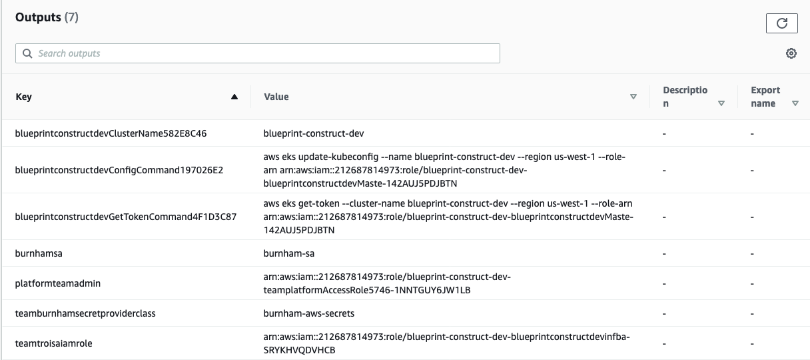

# Secrets Store Add-on

The Secrets Store Add-on provisions the [AWS Secrets Manager and Config Provider(ASCP) for Secret Store CSI Driver](https://docs.aws.amazon.com/secretsmanager/latest/userguide/integrating_csi_driver.html) on your EKS cluster. With ASCP, you now have a plugin for the industry-standard Kubernetes Secrets Store [Container Storage Interface (CSI) Driver](https://github.com/kubernetes-sigs/secrets-store-csi-driver) used for providing secrets to applications operating on Amazon Elastic Kubernetes Service.

With ASCP, you can securely store and manage your secrets in [AWS Secrets Manager](https://docs.aws.amazon.com/secretsmanager) or [AWS Systems Manager Parameter Store](https://docs.aws.amazon.com/systems-manager/latest/userguide/systems-manager-parameter-store.html) and retrieve them through your application workloads running on Kubernetes. You no longer have to write custom code for your applications.

## Usage

### **`index.ts`**

```typescript
import 'source-map-support/register';
import * as cdk from 'aws-cdk-lib';
import * as blueprints from '@aws-quickstart/eks-blueprints';

const app = new cdk.App();

const addOn = new blueprints.addons.SecretsStoreAddOn();

/* Setup application team with secrets
 * Here we are generating a new SecretManager secret for AuthPassword
 * We are also looking up a pre-existing secret in Parameter Store called GITHUB_TOKEN
 */

export class TeamBurnham extends ApplicationTeam {
    constructor(scope: Construct) {
        super({
            name: "burnham",
            users: getUserArns(scope, "team-burnham.users"),
            teamSecrets: [
                {
                    secretProvider: new blueprints.GenerateSecretManagerProvider('AuthPassword'),
                    kubernetesSecret: {
                        secretName: 'auth-password',
                        data: [
                            {
                                key: 'password'
                            }
                        ]
                    }
                },
                {
                    secretProvider: new blueprints.LookupSsmSecretByAttrs('GITHUB_TOKEN', 1),
                    kubernetesSecret: {
                        secretName: 'github'
                    }
                }
            ]
        });
    }
}

const blueprint = blueprints.EksBlueprint.builder()
  .addOns(addOn)
  .teams(new TeamBurnham(app))
  .build(app, 'my-stack-name');
```

## Functionality

1. Installs the [Kubernetes Secrets Store CSI Driver](https://github.com/kubernetes-sigs/secrets-store-csi-driver) in the `kube-system` namespace.
2. Installs [AWS Secrets Manager and Config Provider for Secret Store CSI Driver](https://github.com/aws/secrets-store-csi-driver-provider-aws) in the `kube-system` namespace.
3. Creates an IAM access policy for scoped down to just the secrets the provided namespace should have access to.
4. Updates [IAM roles for service accounts](https://docs.aws.amazon.com/eks/latest/userguide/create-service-account-iam-policy-and-role.html) `[team-name]-sa` for policies to grant read access to the provided secrets.
5. Creates a [SecretProviderClass](https://github.com/aws/secrets-store-csi-driver-provider-aws#secretproviderclass-options) `[team-name]-aws-secrets` which tells the AWS provider which secrets can be mounted in an application pod in the provided namespace.

## Security Considerations

The AWS Secrets Manger and Config Provider provides compatibility for legacy applications that access secrets as mounted files in the pod. Security conscious applications should use the native AWS APIs to fetch secrets and optionally cache them in memory rather than storing them in the file system.

## Example

After the Blueprint stack is deployed you can test consuming the secret from within a `deployment`.

This sample `deployment` shows how to consume the secrets as mounted volumes as well as environment variables.

```sh
cat << EOF >> test-secrets.yaml
apiVersion: apps/v1
kind: Deployment
metadata:
  name: app-deployment
  labels:
    app: myapp
  namespace: team-burnham
spec:
  replicas: 1
  selector:
    matchLabels:
      app: myapp
  template:
    metadata:
      labels:
        app: myapp
    spec:
      serviceAccountName: burnham-sa
      volumes:
      - name: secrets-store-inline
        csi:
          driver: secrets-store.csi.k8s.io
          readOnly: true
          volumeAttributes:
            secretProviderClass: burnham-aws-secrets
      containers:
      - name: test-secrets
        image: public.ecr.aws/ubuntu/ubuntu:latest
        command: [ "/bin/bash", "-c", "--" ]
        args: [ "while true; do sleep 30; done;" ]
        resources:
          limits:
            cpu: "100m"
            memory: "128Mi"
          requests:
            cpu: "100m"
            memory: "128Mi"
        env:
          - name: PASSWORD
            valueFrom:
              secretKeyRef:
                name: auth-password
                key: password
          - name: GITHUB_TOKEN
            valueFrom:
              secretKeyRef:
                name: github
                key: GITHUB_TOKEN
        volumeMounts:
          - name: secrets-store-inline
            mountPath: /mnt/secrets-store
            readOnly: true
EOF
```

The values for `serviceAccountName` and the `secretProviderClass` shown in the example above are obtained from CloudFormation outputs of the blueprint stack shown in the screenshot below as `burnhamsa` and `teamburnhamsecretproviderclass`.



Apply the manifest.

```sh
$ kubectl apply -f test-secrets.yaml
deployment.apps/app-deployment created
```

Test that kubernetes secret `burnham-github-secrets` was created.

```sh
kubectl get secrets -n team-burnham
NAME                     TYPE                                  DATA   AGE
auth-password            Opaque                                1      19s
burnham-sa-token-fqjqw   kubernetes.io/service-account-token   3      64m
default-token-7fn69      kubernetes.io/service-account-token   3      64m
github                   Opaque                                1      19s
```

Test that the deployment has completed and the pod is running successfully.

```sh
$ kubectl get pods -n team-burnham
NAME                              READY   STATUS    RESTARTS   AGE
app-deployment-6867fc6bd6-jzdwh   1/1     Running   0          46s
```

Next, test whether the secret `PASSWORD` is available as an environment variable from within the `app-deployment` pod.

```sh
$ kubectl exec app-deployment-6867fc6bd6-jzdwh -n team-burnham -- echo $PASSWORD

XXXXXXXXXXXXXXXXXX
```

Test whether `GITHUB_TOKEN` is available as an environment variable from within the `app-deployment` pod.

```sh
$ kubectl exec app-deployment-6867fc6bd6-jzdwh -n team-burnham -- echo $GITHUB_TOKEN

ghp_XXXXXXXXXXXXXXXXXXXXXXXXXX
```
