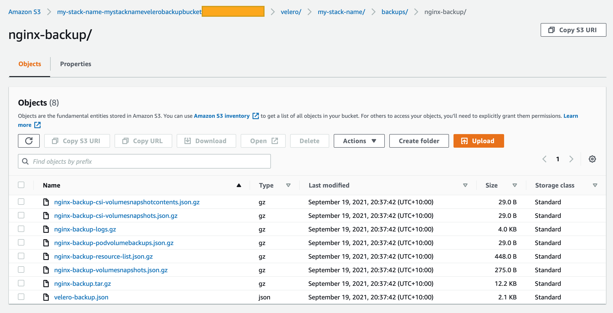
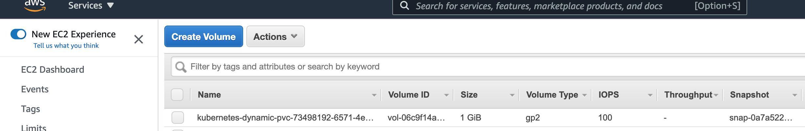

# Velero Add-On

The [Velero(formerly Heptio Ark)](https://velero.io/docs) is a tool to backup and restore your Kubernetes cluster resources and persistent volumes. Velero lets you :

- Take backups of your cluster and restore in case of loss.
- Migrate cluster resources to other clusters.
- Replicate your production cluster to development and testing clusters.

Velero consists of:

- A server that runs on your cluster
- A command-line client that runs locally

The Velero add-on installs Velero on Amazon EKS. By default it will create a private encrypted S3 Bucket to be the Velero backup destination. It leverages [IAM Role for Service Accounts (IRSA)](https://docs.aws.amazon.com/eks/latest/userguide/iam-roles-for-service-accounts.html) feature to enable Velero pod to make API calls with S3 and EC2 natively without the need to use kube2iam or AWS credentials. 

## Usage

```typescript
import 'source-map-support/register';
import * as cdk from 'aws-cdk-lib';
import * as blueprints from '@aws-quickstart/eks-blueprints';

const app = new cdk.App();

const addOn = new blueprints.addons.VeleroAddOn();

const blueprint = blueprints.EksBlueprint.builder()
  .addOns(addOn)
  .build(app, 'my-stack-name');
```

## Functionality

1. By default create a private S3 bucket (blocking all public access) with SSE-KMS encryption with AWS Managed Key from KMS(Encryption At Rest) for the Velero Backup destination.
2. Configure S3 Bucket policy to enable encryption in transit.
3. Create the IAM Role for Service Account for Velero pod to make API calls to AWS S3 and EC2 to backup and restore.
4. Preset [Velero Helm Chart Values](https://github.com/vmware-tanzu/helm-charts/blob/main/charts/velero/values.yaml).
5. Allow users to pass [Velero Helm Chart Values](https://github.com/vmware-tanzu/helm-charts/blob/main/charts/velero/values.yaml) for customization purposes. 
6. Supports [standard helm configuration options](./index.md#standard-helm-add-on-configuration-options).


## Limitations

1. Velero has a known bug for support of S3 with SSE-KMS encryption with Customer master key (CMK). Please refer to [Velero GitHub Issue #83](https://github.com/vmware-tanzu/helm-charts/issues/83).
2. As a result of #1, Velero is unable to leverage the [S3 Bucket Key](https://docs.aws.amazon.com/AmazonS3/latest/userguide/bucket-key.html) feature which requires using AWS CMK to achieve "reduce AWS KMS request costs by up to 99 percent by decreasing the request traffic from Amazon S3 to AWS KMS."

## Testing Velero Functionality

The following steps will help test the backup and restore Kuberenetes resources from Velero

1. Deploy a sample app as deployment into a newly created namespace
2. Backup the sample app from the namespace
3. Delete the sample app namespace
4. Restore the sample app

### Deploy a sample app into a newly created namespace

- Properly configure your `kubeconfig` to use `kubectl` command. By successfully deploying the EKS cluster, you can run commands to set up your `kubeconfig` correctly by: `aws eks update-kubeconfig --name <EKS_Cluster_Name>  --region <AWS_Region> --role-arn arn:aws:iam::<AWS_ACCOUNT_ID>:role/<IRSA_Role_Name>`

```bash
# Create the test01 namespace
$ kubectl create ns test01
namespace/test01 created

# Deploy the Nginx Stateless applications on to namespace test01
$ kubectl apply -f https://k8s.io/examples/application/deployment.yaml -n test01
deployment.apps/nginx-deployment created

# Check the nginx pods
$ kubectl get pods -n test01
NAME                                READY   STATUS    RESTARTS   AGE
nginx-deployment-66b6c48dd5-qf7lc   1/1     Running   0          53s
nginx-deployment-66b6c48dd5-wvxjx   1/1     Running   0          53s

# Deploy the Stateful Nginx Application with PV to namespace nginx-example
$ kubectl apply -f https://raw.githubusercontent.com/vmware-tanzu/velero/main/examples/nginx-app/with-pv.yaml
namespace/nginx-example created
persistentvolumeclaim/nginx-logs created
deployment.apps/nginx-deployment created
service/my-nginx created

# Check the application and PV
$ kubectl get pods -n nginx-example
NAME                               READY   STATUS    RESTARTS   AGE
nginx-deployment-66689547d-4mqsd   2/2     Running   0          106s
haofeif@a483e70791e6 ~ $ kubectl get pv -n nginx-example
NAME                                       CAPACITY   ACCESS MODES   RECLAIM POLICY   STATUS   CLAIM                      STORAGECLASS   REASON   AGE
pvc-73498192-6571-4e31-b455-e7e7efbf2fb7   1Gi        RWO            Delete           Bound    nginx-example/nginx-logs   gp2                     110s

## EBS Volume got created 
```


### Backup the sample app from the namespace

- To install Velero client Cli, please refer to the [User Guide](https://velero.io/docs/v1.6/basic-install/)
- The backup will be created into the S3 bucket created or specified by the users. 

```bash
# Create the backup for stateless app at namespace test01
$ velero backup create test01 --include-namespaces test01
Backup request "test01" submitted successfully.
Run `velero backup describe test01` or `velero backup logs test01` for more details.

# Check for the backup
$ velero backup get
NAME       STATUS      ERRORS   WARNINGS   CREATED                          EXPIRES   STORAGE LOCATION   SELECTOR
test01     Completed   0        0          2021-09-20 12:40:37 +1000 AEST   29d       default            <none>

# Check the logs of the backup
$ velero backup logs test01
time="2021-09-19T02:40:37Z" level=info msg="Setting up backup temp file" backup=velero/test01 logSource="pkg/controller/backup_controller.go:556"
time="2021-09-19T02:40:37Z" level=info msg="Setting up plugin manager" backup=velero/test01 logSource="pkg/controller/backup_controller.go:563"
time="2021-09-19T02:40:37Z" level=info msg="Getting backup item actions" backup=velero/test01 logSource="pkg/controller/backup_controller.go:567"
...

# Check the backup location, the Access mode shows the S3 bucket name and its folders.
$ velero backup-location get
NAME      PROVIDER   BUCKET/PREFIX                                                                         PHASE       LAST VALIDATED                   ACCESS MODE   DEFAULT
default   aws        my-stack-name-mystacknamevelerobackupxxx/velero/my-stack-name   Available   2021-09-20 12:29:35 +1000 AEST   ReadWrite     true

# Screenshot of the S3 bucket folder for the backup test01
```


```bash
# Create the Backup with the PV at namespace nginx-example
$ velero backup create nginx-backup --include-namespaces nginx-example
Backup request "nginx-backup" submitted successfully.
Run `velero backup describe nginx-backup` or `velero backup logs nginx-backup` for more details.

## Check the backup status
$ velero backup get
NAME           STATUS      ERRORS   WARNINGS   CREATED                          EXPIRES   STORAGE LOCATION   SELECTOR
nginx-backup   Completed   0        0          2021-09-20 12:37:36 +1000 AEST   29d       default            <none>

# Screenshot of the S3 bucket folder for the backup nginx-backup (with PV)
```

 

### Delete the sample app namespace

```bash
# Delete the namespace test01
$ kubectl delete ns test01

# Delete the namespace nginx-example
$ kubectl delete ns nginx-example

# Note: Because the default reclaim policy for dynamically-provisioned PVs is “Delete”, these commands should trigger AWS to delete the EBS Volume that backs the PV. Deletion is asynchronous, so this may take some time. 
```

### Restore the sample app

```bash
# Restore from the backup of test01
$ velero restore create test01 --from-backup test01

Restore request "test01" submitted successfully.
Run `velero restore describe test01` or `velero restore logs test01` for more details.

# Check the restore status of test01
$ velero restore get
NAME     BACKUP   STATUS       STARTED                          COMPLETED   ERRORS   WARNINGS   CREATED                          SELECTOR
test01   test01   Completed   2021-09-20 12:41:38 +1000 AEST   <nil>       0        0          2021-09-20 12:41:36 +1000 AEST   <none>

# Check the stateless application restore completed
$ kubectl get pods -n test01
NAME                                READY   STATUS    RESTARTS   AGE
nginx-deployment-66b6c48dd5-qf7lc   1/1     Running   0          53s
nginx-deployment-66b6c48dd5-wvxjx   1/1     Running   0          53s

# Restore from the backup of nginx-backup (With PV) after confirming EBS volume has been deleted successfully
$ velero restore create --from-backup nginx-backup

# Check the Restore status
$ velero restore get
NAME                          BACKUP         STATUS      STARTED                          COMPLETED                        ERRORS   WARNINGS   CREATED                          SELECTOR
nginx-backup-20210920124336   nginx-backup   Completed   2021-09-20 12:43:42 +1000 AEST   2021-09-20 12:43:45 +1000 AEST   0        0          2021-09-20 12:43:40 +1000 AEST   <none>

# Check the status of pod and PV in namespace nginx-example
$ kubectl get pods -n nginx-example
NAME                               READY   STATUS    RESTARTS   AGE
nginx-deployment-66689547d-4mqsd   2/2     Running   0          2m12s

$ kubectl get pv -n nginx-example
NAME                                       CAPACITY   ACCESS MODES   RECLAIM POLICY   STATUS   CLAIM                      STORAGECLASS   REASON   AGE
pvc-73498192-6571-4e31-b455-e7e7efbf2fb7   1Gi        RWO            Delete           Bound    nginx-example/nginx-logs   gp2                     2m22s

# EBS Volume is back
```
