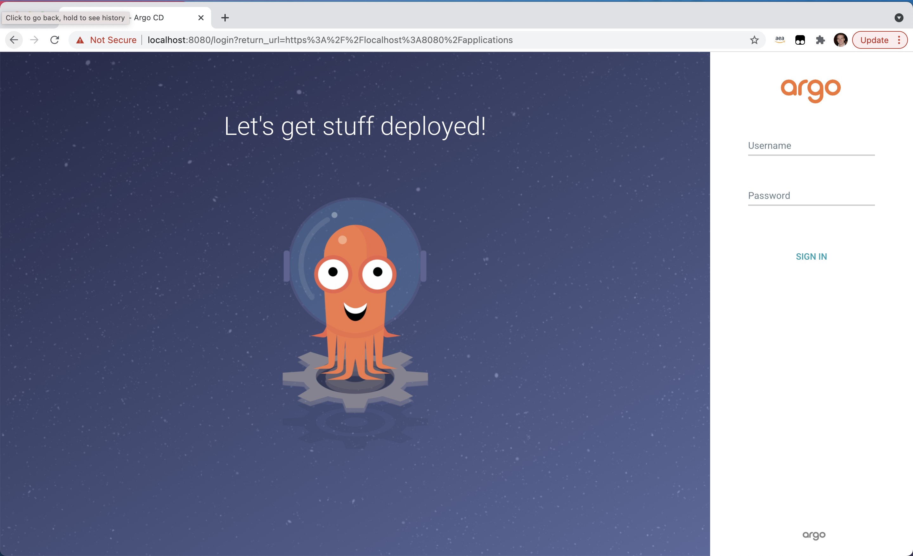

# Getting Started 

This getting started guide will walk you through setting up a new CDK project which leverages the `ssp-amazon-eks` NPM module to deploy a simple SSP. 

## Project setup

To use the `ssp-amazon-eks` module, you must have the [AWS Cloud Development Kit (CDK)](https://aws.amazon.com/cdk/) installed. Install CDK via the following.

```bash
npm install -g aws-cdk@1.124.0
```

Verify the installation.

```bash
cdk --version
```

Create a new `typescript` CDK project in an empty directory.

```bash
cdk init app --language typescript
```

## Deploy a Blueprint EKS Cluster

Install the `ssp-amazon-eks` NPM package via the following.

```bash
npm i @aws-quickstart/ssp-amazon-eks
```

Replace the contents of `bin/<your-main-file>.ts` (where `your-main-file` by default is the name of the root project directory) with the following code. This code will deploy a new EKS Cluster and install the `ArgoCD` addon.

```typescript
import 'source-map-support/register';
import * as cdk from '@aws-cdk/core';
import * as ssp from '@aws-quickstart/ssp-amazon-eks';

const app = new cdk.App();

const addOns: Array<ssp.ClusterAddOn> = [
    new ssp.addons.ArgoCDAddOn,
    new ssp.addons.CalicoAddOn,
    new ssp.addons.MetricsServerAddOn,
    new ssp.addons.ClusterAutoScalerAddOn,
    new ssp.addons.ContainerInsightsAddOn,
    new ssp.addons.AwsLoadBalancerControllerAddOn(),
    new ssp.addons.NginxAddOn,
    new ssp.addons.VpcCniAddOn(),
    new ssp.addons.CoreDnsAddOn(),
    new ssp.addons.KubeProxyAddOn(),
    new ssp.addons.XrayAddOn()
];

const account = 'XXXXXXXXXXXXX';
const region = 'us-east-2';
const props = { env: { account, region } };
new ssp.EksBlueprint(app, { id: 'east-test-1', addOns}, props);
```

Each combination of target account and region must be bootstrapped prior to deploying stacks. Bootstrapping is an process of creating IAM roles and lambda functions that can execute some of the common CDK constructs.

[Bootstrap](https://docs.aws.amazon.com/cdk/latest/guide/bootstrapping.html) your environment with the following command. 

```bash
cdk bootstrap
```

Note: if the account/region combination used in the code example above is different from the initial combination used with `cdk bootstrap`, you will need to perform `cdk bootstrap` again to avoid error.

Please reference [CDK](https://docs.aws.amazon.com/cdk/latest/guide/home.html) usage doc for detail.

Deploy the stack using the following command. This command will take roughly 20 minutes to complete.

```
cdk deploy
```

Congratulations! You have deployed your first EKS cluster with `ssp-amazon-eks`. The above code will provision the following:

- [x] A new Well-Architected VPC with both Public and Private subnets.
- [x] A new Well-Architected EKS cluster in the region and account you specify.
- [x] [Nginx](https://kubernetes.github.io/ingress-nginx/deploy/) into your cluster to serve as a reverse proxy for your workloads. 
- [x] [ArgoCD](https://argoproj.github.io/argo-cd/) into your cluster to support GitOps deployments. 
- [x] [Calico](https://docs.projectcalico.org/getting-started/kubernetes/) into your cluster to support Network policies.
- [x] [Metrics Server](https://github.com/kubernetes-sigs/metrics-server) into your cluster to support metrics collection.
- [x] AWS and Kubernetes resources needed to support [Cluster Autoscaler](https://docs.aws.amazon.com/eks/latest/userguide/cluster-autoscaler.html).
- [x] AWS and Kubernetes resources needed to forward logs and metrics to [Container Insights](https://docs.aws.amazon.com/AmazonCloudWatch/latest/monitoring/deploy-container-insights-EKS.html).
- [x] AWS and Kubernetes resources needed to support [AWS Load Balancer Controller](https://docs.aws.amazon.com/eks/latest/userguide/aws-load-balancer-controller.html).
- [x] [Amazon VPC CNI add-on (VpcCni)](https://docs.aws.amazon.com/eks/latest/userguide/managing-vpc-cni.html) into your cluster to support native VPC networking for Amazon EKS.
- [x] [CoreDNS Amazon EKS add-on (CoreDns)](https://docs.aws.amazon.com/eks/latest/userguide/managing-coredns.html) into your cluster. CoreDns is a flexible, extensible DNS server that can serve as the Kubernetes cluster DNS
- [x] [ kube-proxy Amazon EKS add-on (KubeProxy)](https://docs.aws.amazon.com/eks/latest/userguide/managing-kube-proxy.html) into your cluster to maintains network rules on each Amazon EC2 node
- [x] AWS and Kubernetes resources needed to support [AWS X-Ray](https://aws.amazon.com/xray/).

## Cluster Access

Once the deploy completes, you will see output in your terminal window similar to the following:

```bash
Outputs:
east-test-1.easttest1ClusterName8D8E5E5E = east-test-1
east-test-1.easttest1ConfigCommand25ABB520 = aws eks update-kubeconfig --name east-test-1 --region us-east-1 --role-arn <ROLE_ARN>
east-test-1.easttest1GetTokenCommand337FE3DD = aws eks get-token --cluster-name east-test-1 --region us-east-1 --role-arn <ROLE_ARN>

Stack ARN:
arn:aws:cloudformation:us-east-1:115717706081:stack/east-test-1/e1b9e6a0-d5f6-11eb-8498-0a374cd00e27
```

To update your Kubernetes config for you new cluster, copy and run the `east-test-1.easttest1ConfigCommand25ABB520` command (the second command) in your terminal. 

```
aws eks update-kubeconfig --name east-test-1 --region us-east-1 --role-arn <ROLE_ARN>
```

Validate that you now have `kubectl` access to your cluster via the following:

```
kubectl get namespace
```

You should see output that lists all namespaces in your cluster. 

## Deploy workloads with ArgoCD

Next, let's walk you through how to deploy workloads to your cluster with ArgoCD. This approach leverages the [App of Apps](https://argoproj.github.io/argo-cd/operator-manual/cluster-bootstrapping/#app-of-apps-pattern) pattern to deploy multiple workloads across multiple namespaces. The sample app of apps repository that we use in this getting started guide can be found [here](https://github.com/aws-samples/ssp-eks-workloads).

You can leverage [Automatic Bootstrapping](addons/argo-cd.md#Bootstrapping) for automatic onboarding of workloads. This feature may be leveraged even when workload repositories are not ready yet, as it creates a placeholder for future workloads and decouples workload onboarding for the infrastructure provisioning pipeline. The next steps, described in this guide apply for cases when customer prefer to bootstrap their workloads manually through ArgoCD UI console.

### Install ArgoCD CLI

These steps are needed for manual workload onboarding. For automatic bootstrapping please refer to the [Automatic Bootstrapping](addons/argo-cd.md#Bootstrapping).

Follow the instructions found [here](https://argoproj.github.io/argo-cd/cli_installation/) as it will include instructions for your specific OS. You can test that the ArgoCD CLI was installed correctly using the following:

```
argocd version --short --client
```

You should see output similar to the following:

```
argocd: v2.0.1+33eaf11.dirty
```

### Exposing ArgoCD

To access ArgoCD running in your Kubernetes cluster, we can leverage [Kubernetes Port Forwarding](https://kubernetes.io/docs/tasks/access-application-cluster/port-forward-access-application-cluster/). To do so, first capture the ArgoCD service name in an environment variable.

```
export ARGO_SERVER=$(kubectl get svc -n argocd -l app.kubernetes.io/name=argocd-server -o name) 
```

Next, in a new terminal tab, expose the service locally.

```
kubectl port-forward $ARGO_SERVER -n argocd 8080:443
```

Open your browser to http://localhost:8080 and you should see the ArgoCD login screen.



### Logging Into ArgoCD

ArgoCD will create an `admin` user and password on a fresh install. To get the ArgoCD admin password, run the following.

```
export ARGO_PASSWORD=$(kubectl -n argocd get secret argocd-initial-admin-secret -o jsonpath="{.data.password}" | base64 -d)
```

While still port-forwarding, login via the following.

```
argocd login localhost:8080 --username admin --password $ARGO_PASSWORD
```

You can also login to the ArgoCD UI with generated password and the username `admin`. 

```
echo $ARGO_PASSWORD
```

### Deploy workloads to your cluster

Create a project in Argo by running the following command

```
argocd proj create sample \
    -d https://kubernetes.default.svc,argocd \
    -s https://github.com/aws-samples/ssp-eks-workloads.git
```

Create the application within Argo by running the following command

```
argocd app create dev-apps \
    --dest-namespace argocd  \
    --dest-server https://kubernetes.default.svc  \
    --repo https://github.com/aws-samples/ssp-eks-workloads.git \
    --path "envs/dev"
```

Sync the apps by running the following command

```
argocd app sync dev-apps 
```

### Validate deployments. 

To validate your deployments, leverage `kubectl port-forwarding` to access the `guestbook-ui` service for `team-riker`.

```
kubectl port-forward svc/guestbook-ui -n team-riker 4040:80
```

Open up `localhost:4040` in your browser and you should see the application.

## Next Steps

For information on onboarding teams to your clusters, see [`Team` documentation](../teams). 

For information on deploying Continuous Delivery pipelines for your infrastructure, see [`Pipelines` documentation](../ci-cd).

For information on supported add-ons, see [`Add-on` documentation](../addons)

For information on Onboarding and managing workloads in your clusters, see [`Workload` documentation](../workloads). 